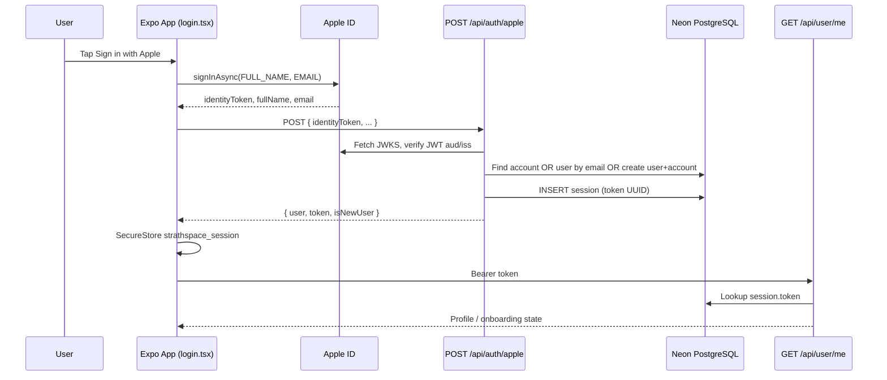

# Apple Sign-In — Backend, Hosted DB, and Mobile Handoff

This document explains how **Sign in with Apple** works in StrathSpace: native iOS login on the mobile app, verification on the **hosted Next.js backend** (`https://www.strathspace.com`), and persistence in the **shared hosted PostgreSQL database** (Neon). It is written for another agent implementing or extending Apple authentication.

For the broader auth architecture (Google, demo login, offline bootstrap, API client), see [`AUTHENTICATION_FLOW_HANDOFF.md`](./AUTHENTICATION_FLOW_HANDOFF.md).

---

## TL;DR

| Layer | What happens |
|-------|----------------|
| **Mobile (iOS)** | `expo-apple-authentication` gets an Apple identity token natively |
| **Custom API** | `POST /api/auth/apple` verifies the token, upserts `user` + `account`, creates `session` |
| **Hosted DB** | Same `user`, `account`, `session` tables Better Auth uses (Drizzle + Neon) |
| **Session use** | Mobile stores the raw DB session token in SecureStore; all APIs send `Authorization: Bearer <token>` |
| **API auth** | `getSessionWithBearerFallback()` resolves Apple sessions the same way as Google/Better Auth sessions |

Apple does **not** use Better Auth's browser OAuth redirect on mobile. It uses a **custom native endpoint** that writes directly into the same database tables.

---

## Architecture

```text
┌─────────────────────┐
│  iOS app (Expo)     │
│  login.tsx          │
│  expo-apple-auth    │
└──────────┬──────────┘
           │ 1. AppleAuthentication.signInAsync()
           │    → identityToken, authorizationCode, fullName, email
           │
           │ 2. POST /api/auth/apple  (hosted backend)
           ▼
┌─────────────────────┐
│  strath-backend     │
│  api/auth/apple/    │
│  route.ts           │
└──────────┬──────────┘
           │ 3. Verify JWT with Apple JWKS (appleid.apple.com/auth/keys)
           │ 4. Lookup/create user + account rows
           │ 5. Insert session row (raw UUID token)
           │
           ▼
┌─────────────────────┐
│  Neon PostgreSQL    │
│  (DATABASE_URL)     │
│  user               │
│  account            │
│  session            │
└──────────┬──────────┘
           │ 6. Return { user, token, isNewUser }
           ▼
┌─────────────────────┐
│  Mobile SecureStore │
│  strathspace_session│
│  strathspace_session_token
└──────────┬──────────┘
           │ 7. Subsequent API calls
           │    Authorization: Bearer <token>
           ▼
┌─────────────────────┐
│  Any protected API  │
│  getSessionWith     │
│  BearerFallback()   │
└─────────────────────┘
```

---

## Why Two Apple Configurations Exist

There are **two** Apple-related setups in the backend. Only one is used by the mobile native flow.

### 1. Better Auth social provider (web / standard OAuth)

**File:** `backend/strath-backend/src/lib/auth.ts`

```ts
socialProviders: {
  apple: {
    clientId: process.env.APPLE_CLIENT_ID!,
    clientSecret: process.env.APPLE_CLIENT_SECRET!,
  },
},
```

This is for Better Auth's standard OAuth flow via `/api/auth/[...all]`. It needs `APPLE_CLIENT_SECRET` (a JWT you generate from your Apple Services ID key). **The custom mobile Apple endpoint does not use this secret.**

### 2. Custom native Apple endpoint (what mobile uses)

**File:** `backend/strath-backend/src/app/api/auth/apple/route.ts`

This endpoint:

- Accepts the **identity token** from `expo-apple-authentication`
- Verifies it with Apple's public keys (JWKS)
- Checks JWT `aud` (audience) against `APPLE_CLIENT_ID` and optionally `APPLE_EXPO_CLIENT_ID`
- Writes to the database directly with Drizzle

**Env vars used by the custom route:**

| Variable | Required | Purpose |
|----------|----------|---------|
| `APPLE_CLIENT_ID` | Yes | Must match iOS bundle ID / Services ID used as token audience (default fallback in code: `com.strathspace.mobile`) |
| `APPLE_EXPO_CLIENT_ID` | No | Extra allowed audience for Expo Go / dev builds when audience differs |
| `DATABASE_URL` | Yes | Neon PostgreSQL connection string |
| `APPLE_CLIENT_SECRET` | No (for this route) | Only used by Better Auth OAuth, not `/api/auth/apple` |

---

## Hosted Database

**File:** `backend/strath-backend/src/lib/db.ts`

The backend connects to **Neon serverless PostgreSQL** via `DATABASE_URL`:

```ts
import { neon } from "@neondatabase/serverless";
import { drizzle } from "drizzle-orm/neon-http";
```

Better Auth is configured with the same DB through `drizzleAdapter`:

```ts
database: drizzleAdapter(db, { provider: "pg", schema }),
```

Apple sign-in, Google sign-in, email/password, and demo login all share these tables.

### Tables touched by Apple login

**`user`** — one row per person

| Column | Apple flow behavior |
|--------|---------------------|
| `id` | New UUID on first sign-up |
| `name` | From `fullName.givenName` + `fullName.familyName` on first sign-in; defaults to `"User"` |
| `email` | From credential or JWT; fallback `{appleId}@privaterelay.appleid.com` |
| `emailVerified` | From JWT `email_verified` claim |
| `role` | `"user"` |

**`account`** — links OAuth provider to user

| Column | Apple flow behavior |
|--------|---------------------|
| `providerId` | `"apple"` |
| `accountId` | Apple `sub` (stable Apple user ID) |
| `accessToken` | Stores `authorizationCode` if provided |
| `userId` | FK to `user.id` |

**`session`** — auth session (same table Better Auth uses)

| Column | Apple flow behavior |
|--------|---------------------|
| `token` | Random UUID returned to mobile as Bearer token |
| `userId` | FK to `user.id` |
| `expiresAt` | **30 days** from creation (see note below) |
| `ipAddress`, `userAgent` | From request headers |

### User resolution logic (backend)

When `POST /api/auth/apple` runs:

1. **Existing Apple account** — `account` where `providerId = 'apple'` AND `accountId = sub` → reuse that `userId`
2. **Email match** — no Apple account, but `user.email` matches → link new `account` row to existing user (e.g. user previously signed up with Google)
3. **New user** — insert `user` + `account`, set `isNewUser: true`

After resolution, always insert a new `session` row and return the token.

---

## Mobile Flow (Step by Step)

### Prerequisites

**`app.json`:**

```json
{
  "expo": {
    "scheme": "strathspace",
    "ios": {
      "bundleIdentifier": "com.strathspace.mobile",
      "usesAppleSignIn": true
    },
    "plugins": ["expo-apple-authentication"]
  }
}
```

**`.env.local` (mobile):**

```env
EXPO_PUBLIC_API_URL=https://www.strathspace.com
```

**Dependency:** `expo-apple-authentication` (already in `package.json`)

### 1. Availability check

**File:** `app/(auth)/login.tsx`

On mount, iOS calls `AppleAuthentication.isAvailableAsync()`. The native Apple button only renders when available (real device / proper build; not all simulators).

### 2. Native sign-in

```ts
const credential = await AppleAuthentication.signInAsync({
  requestedScopes: [
    AppleAuthentication.AppleAuthenticationScope.FULL_NAME,
    AppleAuthentication.AppleAuthenticationScope.EMAIL,
  ],
});
```

Apple returns:

- `identityToken` — JWT the backend must verify (**required**)
- `authorizationCode` — optional; stored in `account.accessToken`
- `fullName` — **only on the user's first Apple sign-in ever** for this app
- `email` — may be present; may be a Hide My Email relay (`*.privaterelay.appleid.com`)
- `user` — Apple user identifier string (sent in body but backend uses JWT `sub`)

### 3. Backend exchange

```http
POST https://www.strathspace.com/api/auth/apple
Content-Type: application/json

{
  "identityToken": "<jwt>",
  "authorizationCode": "<code>",
  "fullName": { "givenName": "...", "familyName": "..." },
  "email": "user@privaterelay.appleid.com",
  "user": "<apple-user-string>"
}
```

**Success response:**

```json
{
  "success": true,
  "data": {
    "user": { "id": "...", "name": "...", "email": "...", ... },
    "token": "<session-uuid>",
    "isNewUser": true
  }
}
```

**Error responses:**

| Status | Meaning |
|--------|---------|
| 400 | Missing `identityToken` |
| 401 | Invalid token or audience mismatch |
| 500 | DB or unexpected server error |

### 4. Local session storage

**File:** `app/(auth)/login.tsx`

On success, mobile writes SecureStore keys (not Better Auth's keys):

```ts
await SecureStore.setItemAsync('strathspace_session', JSON.stringify({
  session: { token, userId, expiresAt },
  user: data.data.user,
}));
await SecureStore.setItemAsync('strathspace_session_token', data.data.token);
```

### 5. Post-login routing

Same as Google: `routeAfterAuth()` → typically fetches `/api/user/me` and routes to onboarding, verification, waitlist, or main tabs based on profile state.

---

## How API Calls Authenticate Apple Sessions

**File:** `backend/strath-backend/src/lib/security.ts`

Protected routes use `getSessionWithBearerFallback(req)`:

1. Try Better Auth cookie/session via `auth.api.getSession()` (web)
2. If no cookie, read `Authorization: Bearer <token>`
3. Strip any `.signature` suffix (Better Auth signed cookies use `token.signature`; Apple returns raw token)
4. Look up `session.token` in PostgreSQL
5. Reject if missing or `expiresAt` is in the past
6. Return `{ session, user }`

**File:** `lib/auth-helpers.ts` (mobile)

`getAuthToken()` reads sessions in priority order:

1. Better Auth `strathspace_session_data` (Google flow)
2. Better Auth `strathspace_cookie`
3. Apple custom `strathspace_session`
4. Legacy `strathspace_session_token`

**File:** `lib/api-client.ts`

All protected mobile requests attach:

```ts
Authorization: Bearer ${token}
```

The backend does not care whether the token came from Google (Better Auth) or Apple (custom endpoint). Same `session` table, same Bearer fallback.

---

## Apple Developer Console Setup

For production (`com.strathspace.mobile`):

1. **App ID** — enable "Sign In with Apple" capability
2. **Bundle ID** must match `APPLE_CLIENT_ID` / `ios.bundleIdentifier` (`com.strathspace.mobile`)
3. **Services ID** — only needed if you also run web OAuth through Better Auth
4. **Key** — required for `APPLE_CLIENT_SECRET` (Better Auth web flow), not for native JWT verification

### Audience (`aud`) mismatch — common failure

The identity token's `aud` claim must be in the allowed set:

- `process.env.APPLE_CLIENT_ID` (production bundle ID)
- `process.env.APPLE_EXPO_CLIENT_ID` (optional, for Expo Go dev)

If verification fails with "unexpected audience", check server logs in `verifyAppleToken()` and align env vars with what Apple puts in the JWT.

---

## Important Behavioral Notes

### Apple only sends name/email once

On **repeat** sign-ins, `fullName` and `email` are often `null`. The backend falls back to:

- Email from the verified JWT payload
- Synthetic email `{appleId}@privaterelay.appleid.com` if none
- Existing DB user record if the Apple account already exists

Onboarding (`app/onboarding/index.tsx`) has special handling for `privaterelay.appleid.com` addresses.

### Session lifetime mismatch

| Source | Session TTL |
|--------|-------------|
| Better Auth config (`auth.ts`) | 90 days |
| Custom `/api/auth/apple` | **30 days** (hardcoded in route) |

Apple sessions expire sooner than Google Better Auth sessions. Consider aligning these if you change the implementation.

### Apple is iOS-only in this app

The Apple button is gated behind `Platform.OS === 'ios'` and `appleAuthAvailable`. Android uses Google (+ optional demo).

### Sign out

`clearSession()` in `lib/auth-helpers.ts` deletes both Better Auth and Apple SecureStore keys and calls `authClient.signOut()`.

---

## Key Files Reference

| File | Role |
|------|------|
| `app/(auth)/login.tsx` | Native Apple button + `handleAppleAuth` |
| `lib/auth-helpers.ts` | Read/clear Apple + Better Auth tokens from SecureStore |
| `lib/api-client.ts` | Attach Bearer token to all API calls |
| `backend/strath-backend/src/app/api/auth/apple/route.ts` | **Core Apple backend logic** |
| `backend/strath-backend/src/lib/auth.ts` | Better Auth config (includes `socialProviders.apple` for web) |
| `backend/strath-backend/src/lib/security.ts` | Bearer session resolution for all APIs |
| `backend/strath-backend/src/lib/db.ts` | Neon PostgreSQL connection |
| `backend/strath-backend/src/db/schema.ts` | `user`, `account`, `session` table definitions |
| `app.json` | `usesAppleSignIn`, bundle ID, plugin |
| `backend/strath-backend/.env.example` | Required env var names |

---

## Implementation Checklist for the Other Agent

### Mobile

- [ ] `expo-apple-authentication` installed and plugin in `app.json`
- [ ] `ios.usesAppleSignIn: true` and correct `bundleIdentifier`
- [ ] `EXPO_PUBLIC_API_URL` points to hosted backend (not localhost unless running backend locally)
- [ ] `handleAppleAuth` posts to `/api/auth/apple` with `identityToken`
- [ ] On success, write `strathspace_session` and `strathspace_session_token` to SecureStore
- [ ] Use `getAuthToken()` / `apiFetch` for all subsequent API calls — do not assume Better Auth cookies
- [ ] Handle cancel (`ERR_REQUEST_CANCELED`) without showing error toast
- [ ] Route through `routeAfterAuth()` / `/api/user/me` — login ≠ onboarding complete

### Backend (deployed environment)

- [ ] `DATABASE_URL` set (Neon production DB)
- [ ] `APPLE_CLIENT_ID=com.strathspace.mobile` (or matching bundle ID)
- [ ] `APPLE_EXPO_CLIENT_ID` set if testing in Expo Go with different audience
- [ ] `/api/auth/apple` route deployed (part of `strath-backend` on Vercel/host)
- [ ] Protected API routes use `getSessionWithBearerFallback`, not cookie-only `auth.api.getSession()`

### Apple Developer

- [ ] Sign In with Apple enabled on App ID
- [ ] Bundle ID matches `APPLE_CLIENT_ID`
- [ ] TestFlight / App Store build uses production API URL

---

## Testing

### Happy path

1. Run on a **real iOS device** or build with proper Apple Sign In entitlements
2. Tap Sign in with Apple
3. Complete Apple ID prompt
4. Confirm `POST /api/auth/apple` returns `success: true` with `token` and `user`
5. Confirm SecureStore has `strathspace_session`
6. Confirm `GET /api/user/me` returns 200 with `Authorization: Bearer <token>`
7. Kill and reopen app — should stay logged in (offline-safe local token read)
8. New user → should route to onboarding

### Returning user

1. Sign in again with same Apple ID
2. Backend should find existing `account` (provider `apple`, `accountId = sub`)
3. New `session` row created; same `user.id`
4. `isNewUser: false`

### Account linking

1. User exists with same email (e.g. from Google)
2. First Apple sign-in with that email → links `account` to existing `user`, no duplicate user row

### Failure cases to verify

| Scenario | Expected |
|----------|----------|
| Wrong `APPLE_CLIENT_ID` / audience | 401 Invalid Apple identity token |
| Expired session (>30 days) | 401 on `/api/user/me` |
| User cancels Apple sheet | No error toast; stay on login |
| Network offline after login | App stays logged in (local token) |

---

## Sequence Diagram



---

## What Not To Do

- Do not route mobile Apple login through Better Auth's browser OAuth — use the native flow + `/api/auth/apple`
- Do not store only Better Auth cookie keys for Apple users — they use separate SecureStore keys
- Do not use `auth.api.getSession()` alone on backend routes called by mobile
- Do not clear session on network errors
- Do not assume `fullName`/`email` exist on every sign-in
- Do not change `strathspace_session` key names without updating `auth-helpers.ts`

---

## Related Docs

- [`AUTHENTICATION_FLOW_HANDOFF.md`](./AUTHENTICATION_FLOW_HANDOFF.md) — full auth architecture (Google, demo, offline bootstrap)
- [`APPLE_SUBMISSION_CHECKLIST.md`](./APPLE_SUBMISSION_CHECKLIST.md) — App Store review checklist
- [`APPLE_REVIEWER_NOTES.md`](./APPLE_REVIEWER_NOTES.md) — reviewer testing notes
