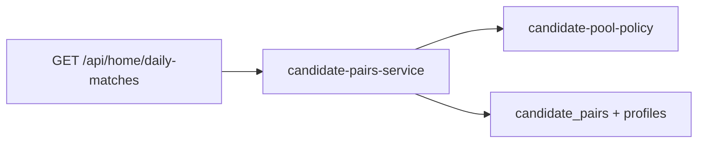

# Home candidate matching (daily intros)

This document describes how **curated candidate introductions** work on Home: building the pool, scoring, fairness, queuing, passes, and notifications. Implementation lives mainly in the backend; the app consumes `GET /api/home/daily-matches`.

## Architecture

Two layers:

| Layer | Role |
|--------|------|
| **[`candidate-pool-policy.ts`](../backend/strath-backend/src/lib/matching/candidate-pool-policy.ts)** | Pure rules: who to exclude directionally, when to skip a dyad, **effective minimum score**, **fair sort** of scored rows. |
| **[`candidate-pairs-service.ts`](../backend/strath-backend/src/lib/services/candidate-pairs-service.ts)** | Orchestration: DB reads/writes, compatibility scoring, batch insert (`active` + `queued`), promotion, expiry, push notifications. |

## Data model: `candidate_pairs`

Each row is an **introduction** between two users (`user_a_id`, `user_b_id` canonical ordering). Status includes:

- **`active`** — both can see and respond; subject to `expires_at`.
- **`queued`** — scheduled for a later **UTC** day (`reveal_at`); not shown as Home card until promoted.
- **`closed`** — at least one side **passed**, or resolved as no longer active.
- **`mutual`** — both chose **open to meet** (flows into date/mutual pipeline).
- **`expired`** — time ran out without mutual/close in the expected way (see expiration job).

History is recorded in `candidate_pair_history` for auditing.

## End-to-end flow (per user)

1. **Expire** stale `active` rows (`expireCandidatePairs`).
2. **Promote** any **due** `queued` row to `active` if this user has no active card and the partner is not blocked by another active card (`promoteDueQueuedPairsForUser`).
3. If the user already has an **active** candidate pair (within expiry window), **return it** — no new generation.
4. If the user still has **any** `queued` row (future reveals or waiting on partner), **do not** run a new scoring batch — avoids duplicate batches.
5. Else **generate** a new batch (`generateCandidatePairsForUser`): pool → score → threshold → insert up to **N** rows (one `active`, rest `queued`).

The **cron** (`/api/cron/candidate-pairs`) runs promotion + generation for active users on a schedule so queued intros become active without requiring an app open.

**Client:** [`use-daily-matches`](../hooks/use-daily-matches.ts) + Home UI; push type `NEW_CANDIDATE_MATCH` when an intro goes live.

## 1. Who can appear in the raw pool?

Fetched from `profiles` (limit 60), requiring roughly:

- Visible, completed profile, not paused, not incognito.
- Gender in the viewer’s **target genders** (`getTargetGenders`).
- Not in `excludedIds`: self, **blocks**, **existing date/matches**, and **users I passed** (directional — see below).

## 2. Reciprocal gender

A candidate must pass **`isReciprocalGenderMatch`**: the viewer’s gender/interests align with the candidate’s, and the candidate’s `interested_in` includes the viewer’s gender. This enforces mutual dating intent at a coarse level.

## 3. Existing dyad map (“never recycle this pair” wrong way)

For each other user id, the service aggregates **all** `candidate_pairs` rows involving the viewer:

| Situation | Effect |
|-----------|--------|
| **`closed` or `mutual`** with that person | **Do not** create another `active`/`queued` row with that unordered pair (`hasClosedOrMutual`). |
| **`active` or `queued`** with that person | Same — dyad already in flight (`hasActive`). |
| **`expired`** only, and expired **recently** (cooldown, `EXPIRED_PAIR_COOLDOWN_DAYS`) | Skip until cooldown passes. |

Implemented via **`shouldSkipCandidateForExistingDyad`** in the policy module.

## 4. Directional pass (“I passed them”)

**`getUsersIPassedIds`** only includes users where **this viewer’s** decision is `passed` on a **`closed`** row — not “any closed pair involving me.” So:

- If **A passes B**, **A** never gets **B** in their candidate query again.
- **B** is **not** added to B’s “I passed” list because of A’s pass; B can still be matched with **other** people. The **same dyad** A–B is still blocked by the dyad map (`closed`).

## 5. Exposure cap (receiver fairness)

Each **candidate** can only appear in at most **`ACTIVE_EXPOSURE_CAP`** (default 2) concurrent **active** candidate rows (as either side). Candidates over the cap are dropped before scoring. This limits hammering the same popular profiles.

## 6. Scoring

For each remaining candidate, **`computeCompatibility`** runs (uses [`match-ranking`](../backend/strath-backend/src/lib/services/match-ranking.ts) style signals). Produces a **0–100** score and short **reasons** stored on the row.

The scoring model blends nine component signals. The seven core components feed a weighted sum; activity and profile quality are applied as a **freshness multiplier** (~0.92–1.05) so they act as tiebreakers rather than dominating compatibility:

| Component | Weight | How it is computed |
|---|---|---|
| `interests` | 18% | Dice + coverage similarity over interest / quality / language token sets, after synonym canonicalisation (`listening to music` ≈ `music` ≈ `musician`) and light stemming. |
| `personality` | 20% | Per-field compatibility table (sleepSchedule, socialVibe, socialBattery, convoStyle, idealDateVibe, driveStyle). Graded 0–1, not strict equality, so `night_owl` ↔ `late_riser` ≈ 0.9. |
| `lifestyle` | 16% | Per-field compatibility table (relationshipGoal, outingFrequency, drinks, smokes). Handles compatible-but-different answers (`no` ↔ `rarely` drinking, `serious_relationship` ↔ `long_term`). |
| `communication` | 10% | Matching communication style + love language (base 65, up to 100). |
| `relationshipIntent` | 16% | 2D intent compatibility map keyed by normalised intent buckets (`serious`, `long_term`, `relationship`, `marriage`, `exploring`, `casual`, `friends`, `not_sure`). Free-text intents are classified into buckets before lookup. |
| `values` | 5% | Dice similarity over canonicalised bio / prompt keywords. Heavily de-weighted because raw bio text is noisy. |
| `campusContext` | 10% | Base 60; +25 same university, +12 same course, up to +6 for year-of-study proximity. |

After the weighted sum, a small **alignment bonus** (+4) is applied when all three "core fit" signals (intent, personality, lifestyle) land strongly together, and the result is clamped to 0–100. A sample "genuinely good but not identical" match lands in the **mid-80s**; tightly aligned matches reach the low 90s.

## 7. Effective minimum score (fairness / starvation)

A single env **`MIN_CANDIDATE_MATCH_SCORE`** (base bar) is adjusted to **`effectiveMin`** via **`computeEffectiveMinScore`**:

- **Absolute floor** `MIN_CANDIDATE_MATCH_SCORE_FLOOR` — never below this (default 50).
- **Wait-based relax:** days since the **latest** `candidate_pairs.created_at` involving this user — but **only if** they already have **pair history** (`hasPairHistory`). New accounts get **no** wait-based relax so the bar does not drop on day one.
- **Sparse pool:** if, after reciprocal + dyad filters, **`reciprocalPoolSize`** is at or below **`MATCH_SPARSE_POOL_THRESHOLD`**, add extra relax steps.
- **Optional imbalance:** if `MATCH_IMBALANCE_RELAX_ENABLED=true` and the **count** of visible profiles in the target genders (same exclusions) is below **`MATCH_IMBALANCE_OPPOSITE_MIN`**, add **one** extra relax step.

Relax steps are capped by **`MATCH_MAX_TOTAL_RELAX_STEPS`**; each step subtracts **`MATCH_SCORE_RELAX_PER_STEP`** points from the base minimum, then clamp to the floor.

**Important:** This improves **chances of an intro** when the pool is thin or the user has waited; it does **not** guarantee a mutual match if the market is imbalanced (e.g. many more seekers than sought).

## 8. Ordering who gets the batch slots

Among rows with `score >= effectiveMin`:

1. **Higher score** first.
2. **Tie:** lower **`activeExposureCount`** for the **candidate** (spread load).
3. **Tie:** deterministic **`candidate.userId`** string order.

Then take the top **`MAX_CANDIDATE_QUEUE_SIZE`** (default 5).

## 9. Batch insert: one active + queued stagger

- **Index 0:** `status = active`, normal **`expires_at`**, **push** to both users (`NEW_CANDIDATE_MATCH`).
- **Index 1…:** `status = queued`, **`reveal_at`** on successive **UTC** midnights starting at **start of next UTC day** (see `startOfNextUtcDay` / `addUtcDays` in the service).

Queued rows use a long placeholder `expires_at` until promotion.

## 10. Responses (`respondToCandidatePair`)

- Only **`active`** non-expired pairs.
- Decisions: `passed` | `open_to_meet`.
- **One pass** → usually **`closed`**; dyad rules + directional pass apply for future runs.
- **Both open to meet** → **`mutual`** and downstream date flow.

## 11. Notifications

When an intro becomes **`active`** (new batch or promotion), both users may receive a push (if tokens exist) with type **`new_candidate_match`** and route to Home.

## 12. Environment variables (reference)

See **[`.env.example`](../backend/strath-backend/.env.example)** for the full list. Matching-related highlights:

| Variable | Default | Purpose |
|----------|---------|---------|
| `MIN_CANDIDATE_MATCH_SCORE` | `72` | Base minimum compatibility (0–100). Calibrated so good matches (~mid-80s) clear the gate easily and mediocre ones (<70) do not. |
| `MIN_CANDIDATE_MATCH_SCORE_FLOOR` | `62` | Hard floor after relax — we never drop below this even for long-waiting users or very sparse pools. |
| `MATCH_SCORE_RELAX_PER_STEP` | `3` | Points subtracted from the base minimum per relax step (wait / sparse / imbalance). |
| `MAX_CANDIDATE_QUEUE_SIZE` | `5` | Max rows per batch (1 live + rest queued). |
| `CANDIDATE_PAIR_EXPIRY_MINUTES` | `1440` | Active card lifetime. |
| `MATCH_WAIT_DAYS_BEFORE_RELAX` | `3` | Days between each wait-based relax step (only applies if the user already has pair history). |
| `MATCH_MAX_SCORE_RELAX_STEPS` | `4` | Cap on wait-based relax steps. |
| `MATCH_SPARSE_POOL_THRESHOLD` | `8` | If the reciprocal pool is at or below this size, apply extra relax steps. |
| `MATCH_SPARSE_EXTRA_RELAX_STEPS` | `1` | How many extra steps to apply when the pool is sparse. |
| `MATCH_MAX_TOTAL_RELAX_STEPS` | `6` | Hard cap on wait + sparse + imbalance relax combined. |
| `MATCH_IMBALANCE_RELAX_ENABLED` | off | Optional; when `true`, adds one relax step if the opposite-side pool is below `MATCH_IMBALANCE_OPPOSITE_MIN`. |

## 13. Cases this system does **not** solve by itself

- **Guaranteed** mutual match for every user in a skewed gender / preference ratio.
- **Re-showing** someone you did not pass after they passed you (dyad remains **closed** for that pair).
- **Timezone-aware** stagger (v1 uses **UTC** for `reveal_at`).

For product copy when no card is available, see the Home **empty state** component (`empty-matches`).

## Related files

| Area | Path |
|------|------|
| Policy | [`backend/strath-backend/src/lib/matching/candidate-pool-policy.ts`](../backend/strath-backend/src/lib/matching/candidate-pool-policy.ts) |
| Orchestrator | [`backend/strath-backend/src/lib/services/candidate-pairs-service.ts`](../backend/strath-backend/src/lib/services/candidate-pairs-service.ts) |
| Compatibility | [`backend/strath-backend/src/lib/services/compatibility-service.ts`](../backend/strath-backend/src/lib/services/compatibility-service.ts), [`match-ranking.ts`](../backend/strath-backend/src/lib/services/match-ranking.ts) |
| Home API | [`backend/strath-backend/src/app/api/home/daily-matches/route.ts`](../backend/strath-backend/src/app/api/home/daily-matches/route.ts) |
| Cron | [`backend/strath-backend/src/app/api/cron/candidate-pairs/route.ts`](../backend/strath-backend/src/app/api/cron/candidate-pairs/route.ts) |
