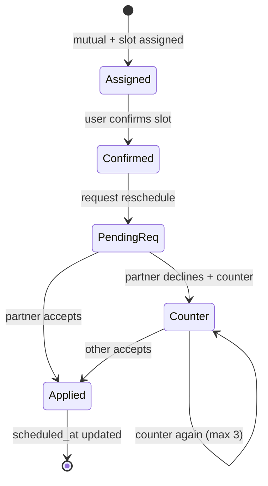

# StrathSpace Meetup Reschedule — Phased Build Plan

This folder breaks **partner-initiated date reschedule** into small, independently
buildable, independently testable phases. **Do not build everything at once.**
Build one phase, test it using the "How to test" section in that phase's doc,
get it green, then move to the next phase.

---

## Product summary

Users can **request a date change** after they have confirmed their assigned slot.
They pick a **different upcoming Wednesday or Saturday** window (same venue rules
as today). The partner sees the proposal and can **Accept** (date moves, both
treated as confirmed) or **Decline** with a reason and a **counter-proposal**
(their own slot choice). The loop continues until they agree or hit a counter
cap, then only Accept or Cancel match remains.

**Not in scope for v1:** free-form date/time pickers, changing venue, admin-less
reschedule after the date is `upcoming`/`completed`, or reschedule before the
requester has confirmed their slot.

---

## Locked decisions

| Decision | Choice |
|---|---|
| **What can change** | **Date/time slot only** — still Wed 17:30 / Sat 15:00 EAT at the default venue. |
| **How users pick** | **Slot list** — next ~4 valid upcoming Wed/Sat options from `meetup-slot-service`, not free-form pickers. |
| **Who can request** | User who has **`viewerSlotConfirmed`** on the mutual match (confirm first, then request change). |
| **Accept behavior** | **Accept = agreement** — update `scheduled_at` / `slot_confirm_by` / `assigned_slot`, set both slot-confirmed timestamps, run finalize path → `upcoming` + `DATE_SCHEDULED` push. No second confirm round. |
| **Decline behavior** | Required **reason** (text) + required **counter slot** → new `pending` request for the other user; previous request `superseded`. |
| **Ping-pong cap** | **3 counter-proposals** per chain; after that, responder can only Accept or Cancel match (no more counter). |
| **Concurrency** | **One `pending` request** per `mutual_match` at a time. |
| **Expiry** | While a reschedule is `pending`, **do not expire** the match for missed `slot_confirm_by` (pause expiry — phase 7). |
| **Payments** | If `payments_enabled`, reschedule allowed only when viewer is **paid + slot-confirmed** (same bar as confirm). Accept does not re-charge. |
| **Rollout** | No separate feature flag for v1 — ship behind existing match-hold flows. Optional `reschedule_enabled` flag can be added in phase 1 if you want a kill switch. |

---

## How reschedule fits the REAL flow

Today:

```txt
Mutual match → assignMeetupSlot → each confirms → tryFinalizeConfirmedMeetup → upcoming
```

After this feature:

```txt
Both confirmed (or one waiting) on assigned slot
        ↓
User A: "Request date change" → pick new Wed/Sat slot → pending request
        ↓
User B: Accept → apply slot + finalize (or already upcoming → stay upcoming with new time)
        OR Decline + reason + counter slot → pending flips to User A
        ↓
Repeat until Accept OR counter cap OR Cancel match
```



---

## Codebase map (reference)

| Area | Location |
|---|---|
| Slot assignment | `backend/strath-backend/src/lib/services/meetup-slot-service.ts` |
| Confirm / finalize | `backend/strath-backend/src/lib/services/meetup-confirmation-service.ts` |
| Match hold / cancel | `backend/strath-backend/src/lib/services/match-hold-service.ts` |
| Push (meetup) | `backend/strath-backend/src/lib/services/meetup-push-notifications-service.ts` |
| Schema | `backend/strath-backend/src/db/schema.ts` |
| Mobile confirm UI | `strath-mobile/components/dates/meetup-slot-confirm.tsx` |
| Mobile modal | `strath-mobile/components/dates/meetup-slot-confirm-modal.tsx` |
| Chat gate | `strath-mobile/components/chat/chat-access-gate.tsx` |
| Confirm API | `POST /api/me/match-hold/confirm-slot` |

---

## Build order (each is its own doc)

Build strictly top to bottom. Later phases depend on earlier ones.

| # | Phase | Doc | Ships value on its own? |
|---|---|---|---|
| 1 | Database schema | [`phase-01-database.md`](./phase-01-database.md) | Foundation |
| 2 | Slot options API helper | [`phase-02-slot-options.md`](./phase-02-slot-options.md) | Testable list of slots |
| 3 | Reschedule service (request / respond) | [`phase-03-reschedule-service.md`](./phase-03-reschedule-service.md) | Core logic via tests/curl |
| 4 | HTTP API routes | [`phase-04-api-routes.md`](./phase-04-api-routes.md) | Mobile can call APIs |
| 5 | Expose state in existing reads | [`phase-05-read-apis.md`](./phase-05-read-apis.md) | App knows pending request |
| 6 | Notifications + push types | [`phase-06-notifications.md`](./phase-06-notifications.md) | Partner gets nudged |
| 7 | Expiry pause + guardrails | [`phase-07-guardrails-expiry.md`](./phase-07-guardrails-expiry.md) | Safe edge cases |
| 8 | Mobile hooks + types | [`phase-08-mobile-hooks.md`](./phase-08-mobile-hooks.md) | App wired to API |
| 9 | Mobile UI — request flow | [`phase-09-mobile-request-ui.md`](./phase-09-mobile-request-ui.md) | "Request date change" |
| 10 | Mobile UI — respond flow | [`phase-10-mobile-respond-ui.md`](./phase-10-mobile-respond-ui.md) | Accept / decline / counter |
| 11 | Deep links + badges | [`phase-11-deeplinks-badges.md`](./phase-11-deeplinks-badges.md) | Opens right screen |
| 12 | Admin visibility (optional) | [`phase-12-admin.md`](./phase-12-admin.md) | Ops can see history |

Minimum for a pilot: **phases 1–10.** Phases 11–12 improve ops and re-engagement.

---

## Global setup before phase 1

1. Backend: `strath-mobile/backend/strath-backend` — `npm run dev`, Drizzle migrations in `drizzle/`.
2. Mobile: `strath-mobile/` — Expo app pointed at your API URL.
3. Seed a mutual match in slot-confirm state: `src/scripts/create-test-mutual-match.ts` (if present) or use a real mutual from the app.
4. Two test users with push tokens registered if testing notifications (phase 6+).

### Conventions (same as payments docs)

| Concern | How it's done |
|---|---|
| Auth | `getSessionWithFallback(req)` |
| Responses | `successResponse` / `errorResponse` |
| DB writes | `import db from "@/db/drizzle"` |
| DB reads | `import { db } from "@/lib/db"` |
| Push | `sendPushNotification` + types in `notification-types.ts` |
| Migrations | `npx drizzle-kit generate` then `npx drizzle-kit migrate` |

### Test ground rules

- Every phase has a **"How to test"** section — do not skip it.
- Use two accounts (User A / User B) for request/respond flows from phase 4 on.
- Re-run idempotent actions twice where noted (e.g. accept same request).

---

## Status tracker

Tick these off as phases land.

- [x] Phase 1 — Database schema
- [x] Phase 2 — Slot options helper
- [x] Phase 3 — Reschedule service
- [x] Phase 4 — API routes
- [x] Phase 5 — Read APIs (hold + dates list)
- [x] Phase 6 — Notifications
- [x] Phase 7 — Guardrails + expiry pause
- [x] Phase 8 — Mobile hooks
- [x] Phase 9 — Mobile request UI
- [x] Phase 10 — Mobile respond UI
- [x] Phase 11 — Deep links + badges
- [x] Phase 12 — Admin visibility
