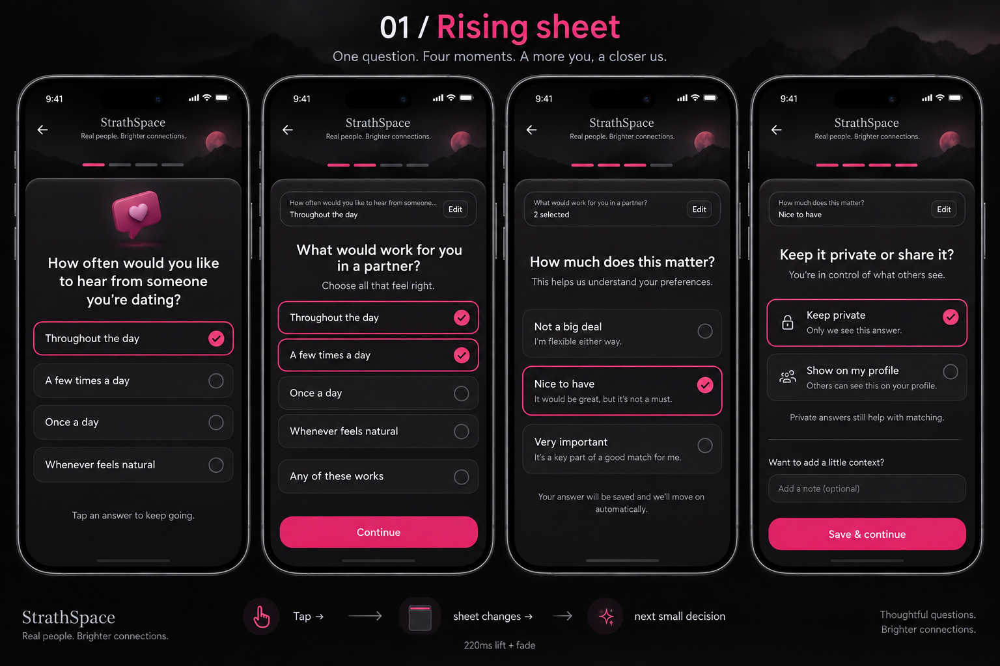
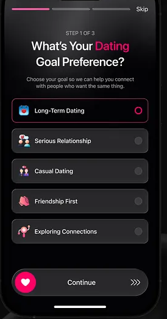

# Rising sheet: onboarding design contract

Approved direction: **Option 1**, selected by the user on 2026-09-24.
Scope: complete mobile onboarding, from entry and account creation through profile, preferences, photos, verification, compatibility answers, and discovery handoff.
Delivery status: phased implementation tracked in [master.md](master.md).

## Authority and reference

Use [DESIGN.md](../../DESIGN.md) for app-wide tokens and this document for onboarding behavior. This contract supersedes older onboarding layout instructions that show all answer fields together or hide follow-ups behind More. Preserve existing API and eligibility rules unless explicitly changed. The user's latest request takes precedence.

The user also approved this close-up for option rows and bottom actions:

Use its dark tonal rows, pink selected outline and right-side indicator, and dark bottom pill with a pink heart circle and trailing chevrons. This is visual guidance: the action remains tap-to-continue, and option labels/icons still come from the actual product catalogue.

The image communicates composition, surfaces, selection feedback, and pacing. It does not define literal copy, progress counts, scoring, privacy promises, or new features. Options 2 and 3 are archived explorations, not implementation targets.

Correct these concept-image artifacts during implementation:
- Use the existing system font and real StrathSpace branding; no invented slogan or serif wordmark.
- A subtle smoky header is sufficient; no scenic mountain/moon wallpaper is required.
- Selection feedback is not a successful server save. Never say “saved” until the API confirms.
- Do not promise “only you will see this”: private answers still participate in matching. Explain actual public comparison visibility.
- Four illustrated screens are moments within one answer, not four completed chapters.
- The three illustrated importance choices are not permission to collapse five stored weights.

## Experience

A person using the phone one-handed between activities should always see one clear next decision. Each answer makes the next beat arrive in place, with no hunt for controls and no growing form.

Use one persistent, raised content sheet beneath a quiet branded header. Replace its content as the user proceeds. Do not open nested operating-system modals on every answer. Real native pickers, permission prompts, and camera interfaces retain their normal behavior.

Show a compact editable summary of the previous answer where helpful. Keep Back available. Do not accumulate prior fields or a long conversation transcript. Longer content may scroll inside the sheet; the action remains reachable with keyboard and safe areas respected.

When a person types, the active text field and its caret must remain visible just above the keyboard. Scroll that field into the sheet's visible area when focus or keyboard height changes; do not leave it hidden behind the keyboard or the pinned action. This applies to optional context and other onboarding text beats.

Progress describes real chapters and saved progress. Keep the twenty-question requirement discoverable in the introduction/progress detail; do not disguise it with a false count or repeatedly put “Question 1 of 20” in the main heading.

## Visual system

| Element | Contract |
| --- | --- |
| Canvas / sheet / controls | Existing dark tokens: #0D0B0D / #151215 / #1E1A1E |
| Accent | #E0186A selection and heart badge; #FF5C97 text accent; at most one pink-filled primary control per screen |
| Text | #F7F3F5 primary; existing muted token with verified contrast |
| Typography | System font; centered onboarding heading; 26–28px display, 15–16px body; support font scaling |
| Shape | 32px top corners on the main sheet, 16px choice rows, pill actions; reuse token values |
| Spacing | 20px outer gutter, 24px sheet inset; existing spacing scale |
| Targets | At least 48 logical pixels for controls; typical choice/action height 56, growing with content |
| Selection | Selected row uses the dark sheet tone, pink outline, and right-side radio dot or check. Unselected rows use the raised control tone. Never rely on color alone; retain accessible selected state. |
| Bottom action | Dark bordered pill, pink circular heart (or task-specific icon) at left, centered label, paired chevrons at right. Disabled state dims icon and label. The whole pill is a tap target, not a required swipe. |
| Decoration | One purposeful small icon/asset where useful; no glass stacks, confetti, neon, or emoji on every row |
| Themes | Dark is the approved reference. Preserve the existing light-mode contract with equivalent contrast and hierarchy |

Use theme/token imports, not per-screen hardcoded colors. Retain the selected visual rhythm across all phases. Reuse existing onboarding primitives after inspecting them; do not create a competing design system.

## Transition rules

- Typical beat transition: 180–220ms, ease-out, opacity and at most 12px vertical translation. Sheet enters from below once when entering the flow.
- Selected answer remains visible long enough to register before the next beat. No arbitrary dwell, typing simulation, or bounce.
- Single-choice: tap, show selected state/haptic, then advance exactly once. Back restores the previous selection and draft.
- Multi-select: visibly checked rows, explicit Continue. “Any of these works” selects all acceptable options, rather than inventing a new answer ID.
- Text/date/range entry: use clear native controls and Continue after valid input. No automatic advance mid-typing.
- Privacy selection reveals the optional note in the normal sequence; it must not require More. Optional note can be left blank.
- Save & continue is the explicit commit for a complete compatibility answer. Prevent duplicate submits. Failure keeps every draft field and offers Retry.
- Terms acceptance and system permissions require deliberate actions; an animated transition never implies consent.
- Respect reduced motion and screen-reader focus. Cancel pending advance when navigating back/unmounting; rapid taps must not skip steps.

## Whole journey

Exact route ownership and cohort ordering must be verified in Phase 1. These are experience chapters, not new API fields:

| Chapter | Included beats | Completion rule |
| --- | --- | --- |
| Welcome and account | Welcome, supported sign-in/sign-up, recovery/verification if present, terms/privacy consent | Existing authentication and consent rules |
| About you | Name if missing, private DOB/18+ eligibility, gender, location | Valid required data saved through existing contract |
| Your preferences | Explicit desired genders, age range, intentions, city or coordinates/radius | Never infer preferences from identity |
| Your profile | Photos, bio/prompt, optional university/course/year | Existing required profile/photo rules; optional fields stay optional |
| Build trust | Face verification, permissions, processing, success/retry/assistance | Actual server verification state |
| Your rhythm | Twenty starter answers in four resumable groups of five | Only successfully saved complete answers count |
| Ready to discover | Honest completion, optional review/edit, handoff | Existing server eligibility gates pass |

Do not force returning users through completed steps or remove their existing conversations. Do not revive obsolete campus/matchmaker/date-payment features as part of this redesign.

## Compatibility answer sequence

| Beat | Copy intent | Interaction |
| --- | --- | --- |
| Your answer | “How often would you like to hear from someone you’re dating?” | Tap one existing catalogue option; advance |
| Partner preference | “What would work for you in a partner?” / “Choose all that feel right.” | Multi-select existing options or select all; Continue |
| Importance | “How much does this matter?” | Tap a named choice; advance |
| Visibility | “Keep it private or share it?” | Explicit Keep private / Show on my profile; reveal note |
| Optional context and save | “Want to add a little context?” | Optional input, visible Save & continue |

Visibility and context may share one sheet, with context revealed once visibility is selected. They must not become a dense combined form. Existing saved answers restore their actual values. New-answer defaults must follow verified product/privacy rules and never silently publish.

### Importance mapping

The current component stores these five weights. Replace the bar with five clear tap rows; numeric weights are internal and must not appear in onboarding.

| Label | Stored weight | Helper intent |
| --- | --- | --- |
| Not a big deal | 0 | I’m flexible about this |
| A little important | 1 | A small preference |
| Somewhat important | 10 | I’d like us to be aligned |
| Very important | 50 | This matters a lot to me |
| Dealbreaker | 250 | This is essential for me |

Confirm backend behavior before writing the final helper for Dealbreaker; do not imply a hard filter if it is only a strong score weight. A future reduction to three choices requires an explicit scoring/migration decision, outside a visual refactor.

## Reliability and accessibility

Keep draft state separate from committed data. Persist drafts through the established safe storage approach; do not log sensitive answers. On restart, restore the last valid incomplete beat without presenting unsaved data as saved. Back/edit preserves partner answers, importance, visibility, and note unless a change makes them invalid; then explain what must be updated.

Handle loading, offline, expired session, invalid data, upload failure, permission denial, pending verification, failed save, and retry inside the same visual system. Route guards, deep links, and completion checks remain authoritative. No discovery unlock from animation completion alone.

Verify screen readers, large text, keyboard avoidance, small devices, Android Back, safe areas, reduced motion, and light/dark contrast. Meaningful state changes move focus or announce the next prompt without repeated announcements.

## Definition of visual acceptance

The user will test the mobile app directly. Codex should expose testable preview states and complete relevant static checks, then record device appearance, motion, accessibility, and interaction checks as user-owned pending validation. Do not claim a device check or capture happened when it did not. A phase's implementation may be marked Done after its code and static acceptance are complete; user device acceptance remains an explicit open item through Phase 08 or until the user reports results.

See [master tracker](master.md) for phased implementation and evidence.
