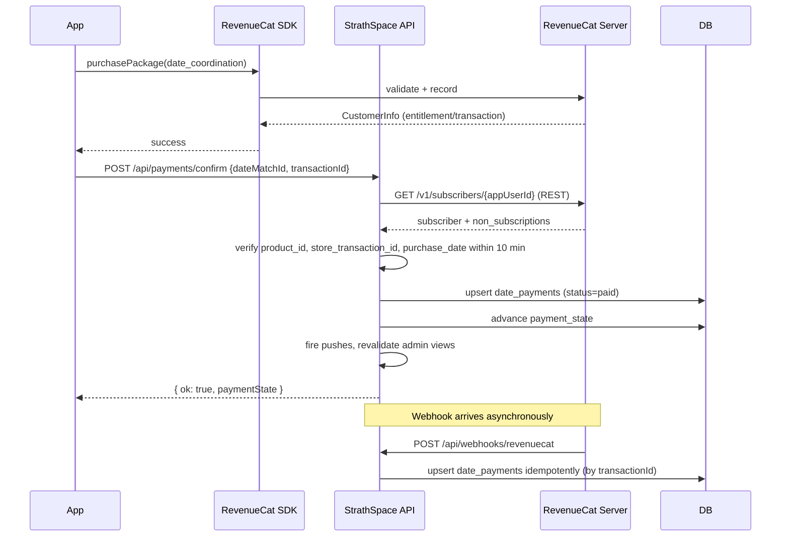

# Payments — Pay-per-Date Model (RevenueCat)

Date: 2026-04-20
Status: **Design** (not yet implemented — ship behind the `payments_enabled` feature flag)

This document is the single source of truth for how money flows through StrathSpace. It covers the product model, user flow, data model, API surface, backend verification, refunds/credits, failure handling, admin controls, feature-flag gating, and environment variables.

It is intended to be read end-to-end before any payment code is written.

---

## 1. Product model at a glance

StrathSpace charges a **Date Coordination Fee**, not a subscription.

- Free to sign up, build a profile, receive curated matches, mutually say "Open to Meet", and take the 3‑minute vibe-check call.
- **Fee is charged only after both users confirm — post-call — that they still want to meet.** That is the moment of real intent.
- StrathSpace arranges the date (venue, time) **only after both users have paid**.

> Positioning copy for the paywall:
> *"A small commitment fee helps us keep StrathSpace intentional, reduce time-wasters, and fund manual coordination by our team."*

### Why pay-per-date (vs. a subscription)

| Concern | Subscription | Pay-per-date |
|---|---|---|
| Filters jokers at the moment they'd ghost | Weak (paying user can still flake) | **Strong** — money is on the line for this specific date |
| Discovery friction | High (paywalls browsing) | **None** — app stays free to explore |
| LTV predictability | Higher, but only if retention holds | Variable, but directly correlated to product value |
| App Store review risk | Medium (paywall on core feature) | Low (paid unlock on a premium moment) |

### Price

| Tier | Price (KES) | When to use |
|---|---|---|
| Launch promo | **150** | First 2–4 weeks, or per-campus launch push |
| **Standard (launch default)** | **200** | Default for V1 |
| Premium test | 300 | Only after the KES 200 price validates |

The fee is **per person, per confirmed date**. Both parties pay; StrathSpace receives 2× per arranged date.

---

## 2. Where payment fits in the existing matching pipeline

The current pipeline (see [`matches.md`](./matches.md)):

```
daily-matches  →  both "Open to Meet"  →  mutual candidate_pair  →  date_matches (pending_setup)
                                                                         │
                                                                         ▼
                                                             3-minute vibe-check call
                                                                         │
                                                                         ▼
                                                           both confirm "still want to meet"
                                                                         │
                                                            ┌──── NEW: payment gate ────┐
                                                            │                           │
                                                            ▼                           ▼
                                                 both paid → admin schedules     one paid → hold / credit
                                                            │
                                                            ▼
                                                 date_matches.status = "scheduled"
                                                            │
                                                            ▼
                                                       attended / no_show
```

The payment step lives **between `callCompleted + userAConfirmed + userBConfirmed`** and **admin scheduling**. The existing `pending_setup` state in `dateMatches` is split by a new `payment_state` column (see §4).

---

## 3. End-to-end user flow

### Step 1 — Free signup
Profile, photos, interests, personality, verification. No payment. No change from today.

### Step 2 — Free daily curated matches
2–4 candidate pairs/day via `/api/home/daily-matches`. No payment.

### Step 3 — Mutual "Open to Meet"
Both users respond `open_to_meet` on the candidate pair → `candidate_pairs.status = mutual` → `dateMatches` row created with `status = pending_setup`. No payment yet.

### Step 4 — 3-minute vibe-check call
Existing `vibeChecks` flow. On completion: `dateMatches.callCompleted = true` → app prompts each user "Still want to meet?".

### Step 5 — Post-call confirmation
Both users tap **Yes, arrange the date** (sets `userAConfirmed` / `userBConfirmed`). Once **both** are true AND `callCompleted = true`:

```
dateMatches.status         = "pending_setup"   (unchanged)
dateMatches.payment_state  = "awaiting_payment" (NEW)
```

App routes both users to the paywall.

### Step 6 — Paywall screen (both users, independently)

```
Title        Confirm your date
Subtext      A small commitment fee helps us keep StrathSpace
             intentional and reduce time-wasters.
Fee          KES 200
Includes     • Date coordination by our team
             • Confirmation with both people
             • Pre-date reminder
             • Follow-up support
Primary CTA  Pay KES 200 to confirm
Secondary    Not anymore   (cancels the match on this side)
Footer       Restore Purchases   Terms   Privacy
```

The paywall **must** include a Restore Purchases button (Apple requirement) and auto-renewal disclosure is **not** required because the product is a non-renewing consumable.

### Step 7 — One user pays

| Role | Status |
|---|---|
| Payer | `payment_state = "paid_waiting_for_other"` → UI: *"You're confirmed. Waiting for the other person."* |
| Non-payer | `payment_state = "awaiting_payment"` → UI: *"They've confirmed. Pay to move forward."* |

Push notification fires to the non-payer: *"X paid — your turn. 24h to confirm."*

### Step 8 — Both users pay
`payment_state = "being_arranged"`. UI: *"We're arranging this one. Our team will reach out soon."* Admin dashboard surfaces the pair in the **Pending Dates** queue (already exists at `/admin/pending-dates`).

### Step 9 — Admin schedules the date
Admin picks venue + time → existing `scheduleDate` action → `dateMatches.status = "scheduled"`, `payment_state = "confirmed"`. Both users receive the existing `DATE_SCHEDULED` push.

### Step 10 — Date completed / missed
Existing flow. Admin marks `attended` / `no_show` / `cancelled`. `payment_state` stays `"confirmed"` or transitions to `"refunded"` if admin issues a refund.

### Step 11 — Feedback
Unchanged. Existing `dateFeedback` flow fires after `attended`.

---

## 4. Data model changes

### 4.1 `date_matches` — add `payment_state` (keeps existing `status` intact)

```sql
ALTER TABLE date_matches ADD COLUMN payment_state text NOT NULL DEFAULT 'not_required';
ALTER TABLE date_matches ADD COLUMN payment_due_by timestamp;
CREATE INDEX date_match_payment_state_idx ON date_matches(payment_state);
```

Payment state machine (new):

| Value | Meaning |
|---|---|
| `not_required` | Payments flag OFF, or legacy row. Bypasses paywall entirely. |
| `awaiting_payment` | Both confirmed post-call; neither has paid. Timer: 24h (`payment_due_by`). |
| `paid_waiting_for_other` | Exactly one user paid. Timer continues from `awaiting_payment`. |
| `being_arranged` | Both paid. Admin queue. |
| `confirmed` | Admin scheduled the date (mirrors `status = scheduled`). |
| `expired` | 24h elapsed without both paying. See §6. |
| `refunded` | Admin issued refund/credit. |

The existing `dateMatches.status` enum is untouched (`pending_setup | scheduled | attended | cancelled | no_show`). `payment_state` is a **parallel, orthogonal** dimension. This avoids touching every place that reads `status` today.

### 4.2 New table: `date_payments` (one row per user per match)

```sql
CREATE TABLE date_payments (
  id uuid PRIMARY KEY DEFAULT gen_random_uuid(),
  date_match_id uuid NOT NULL REFERENCES date_matches(id) ON DELETE CASCADE,
  user_id text NOT NULL REFERENCES "user"(id) ON DELETE CASCADE,

  -- Money
  amount_cents integer NOT NULL,                  -- e.g. 20000 for KES 200.00
  currency text NOT NULL DEFAULT 'KES',

  -- Provider
  provider text NOT NULL,                         -- 'revenuecat' | 'credit'
  platform text,                                  -- 'ios' | 'android' | null for credit
  revenuecat_app_user_id text,
  revenuecat_transaction_id text UNIQUE,          -- idempotency key
  store_transaction_id text,                      -- Apple/Google original id
  product_id text NOT NULL,                       -- e.g. strathspace_date_coordination_fee_200

  -- Lifecycle
  status text NOT NULL DEFAULT 'pending',         -- 'pending' | 'paid' | 'failed' | 'refunded' | 'credited'
  paid_at timestamp,
  refunded_at timestamp,
  refund_reason text,

  -- Audit
  raw_webhook_payload jsonb,                      -- last webhook envelope for debugging
  created_at timestamp NOT NULL DEFAULT now(),
  updated_at timestamp NOT NULL DEFAULT now()
);

CREATE UNIQUE INDEX date_payments_user_match_unique
  ON date_payments(date_match_id, user_id);
CREATE INDEX date_payments_user_idx ON date_payments(user_id);
CREATE INDEX date_payments_status_idx ON date_payments(status);
```

### 4.3 New table: `user_credits` (ledger for refunds-as-credit)

```sql
CREATE TABLE user_credits (
  id uuid PRIMARY KEY DEFAULT gen_random_uuid(),
  user_id text NOT NULL REFERENCES "user"(id) ON DELETE CASCADE,
  amount_cents integer NOT NULL,                  -- +granted / -spent
  currency text NOT NULL DEFAULT 'KES',
  reason text NOT NULL,                           -- 'partner_did_not_pay' | 'admin_refund' | 'date_spent' | 'promo'
  date_match_id uuid REFERENCES date_matches(id) ON DELETE SET NULL,
  admin_user_id text REFERENCES "user"(id) ON DELETE SET NULL,
  created_at timestamp NOT NULL DEFAULT now()
);

CREATE INDEX user_credits_user_idx ON user_credits(user_id);
```

Balance = `SUM(amount_cents)` per `user_id`. Spending a credit inserts a negative row referencing the `date_match_id` it unlocked; a matching `date_payments` row is inserted with `provider = 'credit'`, `status = 'credited'`.

### 4.4 `app_feature_flags` — add the kill switch

```sql
INSERT INTO app_feature_flags (key, enabled, description)
VALUES ('payments_enabled', false,
        'Master switch for the Date Coordination Fee. OFF = all dates bypass payment.')
ON CONFLICT (key) DO NOTHING;
```

This follows the existing pattern in [`src/lib/feature-flags.ts`](../backend/strath-backend/src/lib/feature-flags.ts). The admin toggle at `/admin/feature-flags` gains one more row.

---

## 5. RevenueCat setup

### 5.1 Product

| Field | Value |
|---|---|
| Type | **Consumable** (non-renewing) |
| Apple Product ID | `strathspace_date_coordination_fee_200` |
| Google Product ID | `strathspace_date_coordination_fee_200` |
| Display name | Date Coordination Fee |
| Description | *Confirm your date and let StrathSpace arrange the next step.* |
| Price | KES 200 (set in App Store Connect + Play Console price tiers) |

### 5.2 Offering

| Field | Value |
|---|---|
| Offering ID | `default` |
| Offering name | Date Confirmation |
| Package ID | `date_coordination` |
| Package type | Custom / Consumable |
| Product | `strathspace_date_coordination_fee_200` |

### 5.3 Webhooks

RevenueCat → `POST /api/webhooks/revenuecat` on our backend.

Events we care about:

| Event | Action |
|---|---|
| `INITIAL_PURCHASE` | Mark `date_payments.status = 'paid'`, advance `payment_state`. |
| `NON_RENEWING_PURCHASE` | Same as above (consumable path). |
| `CANCELLATION` / `REFUND` | Mark `date_payments.status = 'refunded'`, set `payment_state = 'refunded'`, notify admin. |
| `EXPIRATION` | Not applicable (consumable), ignore. |
| `PRODUCT_CHANGE` | Log + alert; shouldn't happen for consumables. |

Webhook must be authenticated with the shared secret header `Authorization: Bearer <REVENUECAT_WEBHOOK_SECRET>` and processed **idempotently** keyed on `event.id` + `transaction_id`.

---

## 6. Timers, expiry, and partial-payment rules

### 6.1 24-hour payment window
When `payment_state` becomes `awaiting_payment`:
- Set `payment_due_by = now() + 24h`.
- Enqueue a reminder push at T+12h ("12 hours left to confirm your date").

### 6.2 Expiry cron
New cron at `/api/cron/payment-expiry` (runs every 15 min):

```
SELECT id FROM date_matches
WHERE payment_state IN ('awaiting_payment','paid_waiting_for_other')
  AND payment_due_by < now();
```

For each expired row:

| Before | Refund action | New state |
|---|---|---|
| `awaiting_payment` (nobody paid) | — | `expired` + `dateMatches.status = 'cancelled'` |
| `paid_waiting_for_other` | **Grant paying user a KES 200 credit** (insert `user_credits` row, reason `partner_did_not_pay`). Flag the non-payer for admin review. | `expired` + `cancelled` |

Both users get a push: *"Date didn't get confirmed in time."* The paying user's push also says: *"You've been credited KES 200 toward your next confirmed date."*

### 6.3 User cancels after paying
Not allowed via the app. Copy: *"Need to cancel? Message support."* Admin can issue refund or credit from `/admin/pending-dates` → pair detail sheet.

---

## 7. Refund / credit policy (admin-facing)

| Case | Policy | Who executes |
|---|---|---|
| Partner didn't pay within 24h | Auto-credit to paying user. | Expiry cron |
| StrathSpace can't arrange (no venue/schedule fits) | Refund **or** credit, admin picks. | Admin |
| Payer changes mind < 1h after paying | Credit (not refund). | Support → admin action |
| Payer changes mind > 1h after paying | No refund. | — |
| No-show | No refund. Strikes system may apply later. | — |
| Safety concern / abuse report | Refund + credit + account review. | Admin (manual) |

Admin UI lives in the existing **Pending Dates** and **Scheduled Dates** pages — add a "Refund" and "Convert to credit" button on the pair detail sheet ([`pair-detail-sheet.tsx`](../backend/strath-backend/src/components/admin/ops/pair-detail-sheet.tsx)).

---

## 8. Backend verification flow (never trust the client)



Two paths converge on the same `date_payments` row (keyed by `revenuecat_transaction_id UNIQUE`):
1. **Client confirms** → immediate UI update (`/api/payments/confirm`).
2. **Webhook** → source of truth for status changes, refunds, and anything that happens after the app is closed.

Both paths must be idempotent. Use `ON CONFLICT (revenuecat_transaction_id) DO UPDATE` and advance `payment_state` only on state transitions (never backwards).

---

## 9. API surface (new routes)

| Method | Route | Purpose |
|---|---|---|
| `GET` | `/api/payments/status?dateMatchId=…` | Current payment state for this match for me + partner (flags-aware: returns `{required:false}` when flag OFF). |
| `POST` | `/api/payments/confirm` | Client-side receipt confirm (see §8). |
| `POST` | `/api/payments/use-credit` | Spend a credit instead of paying cash; inserts `date_payments{provider:'credit'}`. |
| `GET` | `/api/me/credits` | User's credit balance + ledger. |
| `POST` | `/api/webhooks/revenuecat` | RevenueCat webhook receiver. |
| `GET` | `/api/public/feature-flags` | Already exists — now also returns `paymentsEnabled`. |

Admin-only (extends existing `src/lib/actions/admin.ts`):

| Action | Purpose |
|---|---|
| `getAdminPayments(filter)` | Paginated ledger across users. |
| `refundDatePayment(paymentId, mode: 'cash' \| 'credit')` | Issue refund or credit; updates `date_payments` + `user_credits` + `payment_state`. |
| `grantUserCredit(userId, amountCents, reason)` | Manual credit grant (promo, goodwill). |

---

## 10. Feature-flag gating (`payments_enabled`)

The golden rule: **no gating logic lives on the client**. The server returns `paymentsEnabled` in `/api/public/feature-flags` and the client uses it purely to decide which UI to show. The server always re-checks on every mutation.

```ts
// src/lib/feature-flags.ts — extension
export const APP_FEATURE_KEYS = {
  demoLoginEnabled: "demo_login_enabled",
  paymentsEnabled: "payments_enabled",
} as const;

export async function isPaymentsEnabled() {
  return isFeatureEnabled(APP_FEATURE_KEYS.paymentsEnabled, false);
}
```

Wrap every gated action:

```ts
// inside the "post-call confirm" handler, after both confirmations are set
if (await isPaymentsEnabled()) {
  await db.update(dateMatches)
    .set({ paymentState: "awaiting_payment", paymentDueBy: addHours(new Date(), 24) })
    .where(eq(dateMatches.id, dateMatchId));
  // push both users to paywall + send push
} else {
  // legacy path: straight to pending_setup / being_arranged
  await db.update(dateMatches)
    .set({ paymentState: "not_required" })
    .where(eq(dateMatches.id, dateMatchId));
}
```

When the flag is OFF:
- Paywall UI is not rendered (app reads the public flag).
- `/api/payments/confirm` returns `400 { error: "payments_disabled" }` defensively.
- Cron for expiry still runs but is a no-op because no rows enter `awaiting_payment`.

This gives us a clean three-phase rollout:
1. **Phase 1 — flag OFF, code shipped.** App Store / Play Store approve the new build. Everyone still uses the free flow.
2. **Phase 2 — flag ON for staff / beta cohort.** Verify end-to-end with real money in sandbox + one real purchase per platform.
3. **Phase 3 — flag ON globally.** Monitor conversion, 24h expiry rate, and no-show rate for 2 weeks; tune price if needed.

---

## 11. App Store / Play Store review checklist

- Product is a **consumable** — no auto-renew disclosure required, but:
- **Restore Purchases button is mandatory** on the paywall (Apple 3.1.1). Even though consumables aren't "restorable", the button must exist and show an empty state.
- Copy on the paywall must include the **price, currency, one-sentence description** of what the purchase unlocks, and links to **Terms** and **Privacy**.
- Reviewer demo account: ship the first build with `payments_enabled = false` — reviewers see the full app without hitting the paywall. Flip the flag after approval.
- If the flag is ever ON during review, provide a sandbox Apple ID and Google test account pre-loaded in App Store Connect / Play Console.
- **Never** offer an M-Pesa / bank-transfer alternative inside the app for this fee — Apple and Google will reject. The fee unlocks a digital coordination service → IAP required. (M-Pesa stays on the table only for out-of-app credits granted by admin.)

---

## 12. Notifications tied to payment events

All via existing `sendPushNotification` helper ([`src/lib/notifications.ts`](../backend/strath-backend/src/lib/notifications.ts)). Add these to `NOTIFICATION_TYPES`:

| Type | Trigger | Body |
|---|---|---|
| `PAYMENT_REQUIRED` | `payment_state → awaiting_payment` | *"You both said yes. Confirm your date with KES 200 — 24h to go."* |
| `PARTNER_PAID` | Partner just paid | *"{name} paid. Your turn — 24h left."* |
| `PAYMENT_REMINDER_12H` | Cron, 12h before `payment_due_by` | *"12 hours to confirm your date with {name}."* |
| `PAYMENT_EXPIRED` | Expiry cron | *"Date with {name} didn't get confirmed in time."* |
| `CREDIT_GRANTED` | On `user_credits` insert (admin or auto) | *"You've been credited KES 200 toward your next confirmed date."* |
| `DATE_BEING_ARRANGED` | `payment_state → being_arranged` | *"You're both confirmed. We're arranging this one."* |

---

## 13. Environment variables

Add to [`.env.example`](../backend/strath-backend/.env.example):

```bash
# ─── Payments (RevenueCat) ───────────────────────────────────────────────
# Master switch lives in the app_feature_flags table; these are credentials.

REVENUECAT_API_KEY_IOS=appl_xxx                  # Public SDK key, iOS
REVENUECAT_API_KEY_ANDROID=goog_xxx              # Public SDK key, Android
REVENUECAT_SECRET_API_KEY=sk_xxx                 # Secret REST key, server-only
REVENUECAT_WEBHOOK_SECRET=whsec_xxx              # Shared secret for webhook auth
REVENUECAT_PROJECT_ID=proj_xxx

DATE_PAYMENT_PRICE_KES=200                       # Display price; must match store config
DATE_PAYMENT_PRODUCT_ID=strathspace_date_coordination_fee_200
DATE_PAYMENT_WINDOW_HOURS=24                     # Controls payment_due_by
DATE_PAYMENT_REMINDER_HOURS=12                   # When to send PAYMENT_REMINDER_12H
```

Mobile (`strath-mobile/.env.local` / app config):

```bash
EXPO_PUBLIC_REVENUECAT_API_KEY_IOS=appl_xxx
EXPO_PUBLIC_REVENUECAT_API_KEY_ANDROID=goog_xxx
```

---

## 14. Analytics events to emit

Extend `EVENT_TYPES` in `src/lib/analytics.ts`:

| Event | Payload | Used for |
|---|---|---|
| `payment_paywall_viewed` | `{dateMatchId}` | Top of funnel |
| `payment_initiated` | `{dateMatchId, productId}` | Purchase started |
| `payment_succeeded` | `{dateMatchId, amountCents, platform}` | Conversion |
| `payment_failed` | `{dateMatchId, reason}` | Diagnose drop-off |
| `payment_expired` | `{dateMatchId, paidCount}` | 24h-window tuning |
| `payment_refunded` | `{dateMatchId, mode}` | Policy tuning |
| `credit_granted` | `{userId, amountCents, reason}` | Cost tracking |
| `credit_spent` | `{userId, amountCents, dateMatchId}` | Ledger |

KPIs on the admin dashboard:
- Paywall → pay conversion (by platform).
- Single-payer expiry rate (signal of joker concentration — ideally trending down).
- Average time-to-pay after paywall view.
- Revenue per confirmed date = ≤ 2 × net price after store cut.

---

## 15. Implementation order (suggested)

1. **Schema migrations** — `payment_state` column, `date_payments`, `user_credits`, `app_feature_flags` seed.
2. **Feature flag** — `payments_enabled` key, wire into `getPublicFeatureFlags`, admin toggle UI.
3. **RevenueCat setup** — dashboard config, products, offerings, sandbox test account.
4. **Server API** — `/api/payments/status`, `/api/payments/confirm`, `/api/payments/use-credit`, `/api/webhooks/revenuecat`.
5. **State machine integration** — hook payment gate into post-call confirmation logic; keep legacy path alive under the flag.
6. **Expiry cron** — `/api/cron/payment-expiry` + `vercel.json` schedule.
7. **Admin UI** — refund/credit controls on pair detail sheet; payments ledger page; feature flag already exists.
8. **Mobile paywall** — `react-native-purchases` SDK, `<PaywallSheet />` component, credit-redeem option, restore-purchases button.
9. **Notifications** — wire up the 6 new push types.
10. **Analytics** — emit events at every step.
11. **Store submission** — ship with flag OFF, get approved, then flip per §10 phases.

---

## 16. Open questions to resolve before build

1. **Does both-confirmed-post-call go through `vibeChecks` or a lighter confirmation?** Current code sets `userAConfirmed` / `userBConfirmed` on `dateMatches` — is there a dedicated endpoint or is it inferred? Need to pick the exact hook point.
2. **Credit-first UX or cash-first UX on the paywall?** If a user has a credit, do we auto-apply (one-tap confirm) or show both options? Recommend auto-apply with a "Use credit" primary CTA.
3. **What's the no-show penalty?** Out of scope for this doc, but it's the natural V2 follow-up and shares infrastructure with credits (negative balance / strike).
4. **Admin manual payment entry?** For users who pay via M-Pesa to support out-of-band (edge cases). Recommended: yes, via a `grantUserCredit` admin action that inserts a `date_payments{provider:'credit'}` row — never pretend IAP happened.

---

## 17. Related files

| Area | Path |
|---|---|
| Feature flags (lib) | [`backend/strath-backend/src/lib/feature-flags.ts`](../backend/strath-backend/src/lib/feature-flags.ts) |
| Feature flags (admin UI) | [`backend/strath-backend/src/app/admin/feature-flags/page.tsx`](../backend/strath-backend/src/app/admin/feature-flags/page.tsx) |
| Feature flags (public API) | [`backend/strath-backend/src/app/api/public/feature-flags/route.ts`](../backend/strath-backend/src/app/api/public/feature-flags/route.ts) |
| Date matches schema | [`backend/strath-backend/src/db/schema.ts`](../backend/strath-backend/src/db/schema.ts) — `dateMatches` |
| Admin actions | [`backend/strath-backend/src/lib/actions/admin.ts`](../backend/strath-backend/src/lib/actions/admin.ts) |
| Admin pair detail | [`backend/strath-backend/src/components/admin/ops/pair-detail-sheet.tsx`](../backend/strath-backend/src/components/admin/ops/pair-detail-sheet.tsx) |
| Candidate matching | [`docs/matches.md`](./matches.md) |
| Notifications helper | [`backend/strath-backend/src/lib/notifications.ts`](../backend/strath-backend/src/lib/notifications.ts) |

---

## 18. Launch Setup Runbook — RevenueCat + Apple + Google

This is the **operational playbook** for turning the code on. The code is done; every step below is a dashboard / console task plus two env-var files. Follow it in order — skipping a step will produce a cryptic error later.

Legend:
- Boxed checkboxes (`[ ]`) are the checklist you tick off as you go.
- "Verify:" lines are sanity checks so you know a step actually worked.

### 18.1 Prerequisites

- [ ] Apple Developer account — **paid, US$99/year**, with the app's bundle id already registered and a distribution provisioning profile usable by EAS. Bundle id example: `com.strathspace.app`.
- [ ] Google Play developer account — **paid, US$25 one-time**, with the Android app created and at least one internal testing track.
- [ ] RevenueCat account — free tier is fine until US$2.5k MTR. Sign up at [app.revenuecat.com](https://app.revenuecat.com).
- [ ] You are a **signer** on Apple's Paid Applications agreement and Google's Merchant agreement. Without this, IAP returns "product unavailable" in production.
- [ ] Kenyan bank details + tax forms submitted on both Apple and Google (otherwise payouts get held indefinitely).

---

### 18.2 Apple App Store Connect — create the IAP

Target: a **Consumable** in-app purchase priced at the KES equivalent of ~US$1.55 so the KES storefront renders as **KES 200**.

1. [ ] Go to [App Store Connect](https://appstoreconnect.apple.com) → **My Apps → StrathSpace → Monetization → In-App Purchases → "+"**.
2. [ ] Choose **Consumable**. (Never "Non-Consumable" and never "Auto-Renewable Subscription" — both break our model.)
3. [ ] Fill in:
   - **Reference Name**: `Date Coordination Fee KES 200`
   - **Product ID**: `strathspace_date_coordination_fee_200` — **must match `DATE_PAYMENT_PRODUCT_ID`** exactly.
4. [ ] Pricing → choose the **Kenya storefront**, set the price to the tier that shows as **KES 200**. Apple will auto-fill equivalents for every other storefront. You can restrict availability to Kenya only for the launch if you want.
5. [ ] **Localization** → add English (Kenya) at minimum:
   - **Display Name**: `Date Coordination Fee`
   - **Description**: `One-time fee to confirm your StrathSpace date and let us arrange the venue and time.`
6. [ ] **Review Information** → upload a screenshot (can be a paywall mock — doesn't have to be the final build). Write a one-line reviewer note: *"Charged only after two users mutually agree to meet after a vibe-check call. See payment.md §1-3 in the project repo."*
7. [ ] Save. Status will be **Ready to Submit**. That's enough for sandbox testing — Apple only blocks production purchases, not sandbox.

> Verify: the product shows up under the app with the green "Ready to Submit" badge.

#### 18.2a App-Specific Shared Secret (Apple → RevenueCat bridge)

RevenueCat needs this to verify receipts with Apple on your behalf.

1. [ ] App Store Connect → **App Information → App-Specific Shared Secret → Generate / Copy**.
2. [ ] Save it somewhere safe for 18.4.

#### 18.2b Sandbox tester

You cannot test real money — Apple requires a throwaway Apple ID.

1. [ ] App Store Connect → **Users and Access → Sandbox → Testers → "+"**.
2. [ ] Create an account with an email you control but **have never used on an Apple ID**. Region: **Kenya**.
3. [ ] On your test iPhone: **Settings → Developer → Sandbox Apple Account** → sign in with that tester.
4. [ ] Do **not** sign in the tester under Settings → App Store on a real device — it can brick the account.

---

### 18.3 Google Play Console — create the IAP

1. [ ] [Play Console](https://play.google.com/console) → **StrathSpace → Monetize → Products → In-app products → Create product**.
2. [ ] Fill in:
   - **Product ID**: `strathspace_date_coordination_fee_200` — **identical to iOS**, identical to `DATE_PAYMENT_PRODUCT_ID`.
   - **Name**: `Date Coordination Fee`
   - **Description**: same copy as iOS.
3. [ ] **Price**: set to **KES 200.00** on the Kenya default price. Let Google auto-convert to other markets.
4. [ ] **Activate** the product (toggle at the top right). An inactive product returns "item unavailable" on device.

> Verify: the product card shows **Active** in green with the correct price.

#### 18.3a Service account (Google → RevenueCat bridge)

RevenueCat needs a service-account JSON to call the Play Developer API for receipt verification.

1. [ ] [Google Cloud Console](https://console.cloud.google.com) → your Play-linked project → **IAM & Admin → Service Accounts → Create**. Name: `revenuecat-billing`.
2. [ ] Grant role **(none)** at the GCP level (we grant access in Play Console separately). Finish.
3. [ ] Open the service account → **Keys → Add Key → JSON → Create**. A file downloads. Save it.
4. [ ] Back in **Play Console → Users and permissions → Invite new users** → paste the service-account email. Grant:
   - **View financial data**
   - **Manage orders and subscriptions**
   - **View app information**
5. [ ] In **Play Console → Setup → API access**, confirm the service account shows up as linked.

> Note: service-account access can take **~36 hours** to fully propagate. Do this early.

#### 18.3b Play Billing closed test

Real purchases on Android require the app to be on a **closed test track** with the tester email added.

1. [ ] Play Console → **Testing → Closed testing → Create track** (name it `internal-revenuecat`).
2. [ ] Add your personal Gmail + 1–2 teammates to the testers list.
3. [ ] Upload at least one AAB build to this track (the EAS build from 18.7 will do).

---

### 18.4 RevenueCat dashboard — connect the stores

1. [ ] [RevenueCat](https://app.revenuecat.com) → **Projects → + New** → name it `StrathSpace`. Pick **Kenya (KES)** as reporting currency.
2. [ ] Inside the project, create **two apps**: one iOS, one Android.
   - iOS → paste the **bundle id** (`com.strathspace.app`) → paste the **App-Specific Shared Secret** from 18.2a → save.
   - Android → paste the **package name** (`com.strathspace.app`) → upload the **service-account JSON** from 18.3a → save.
3. [ ] **Products** tab → **+ New Product**:
   - Identifier: `strathspace_date_coordination_fee_200`
   - Attach the App Store + Play Store products you created (RC auto-detects them once the credentials are set).
   - Type: **Consumable**.
4. [ ] **Offerings → + New Offering** → name it `default`.
   - Add a single **Package** → identifier `$rc_one_time` (or any name; the code reads `current` offering, so just make this the current one).
   - Attach the consumable product.
   - Click **Make Current**.
5. [ ] **API Keys** tab → copy:
   - **iOS Public SDK key** → goes to `EXPO_PUBLIC_REVENUECAT_API_KEY_IOS`.
   - **Android Public SDK key** → goes to `EXPO_PUBLIC_REVENUECAT_API_KEY_ANDROID`.
   - **Secret REST API key** (under "Secret keys" — click reveal) → goes to `REVENUECAT_SECRET_API_KEY` on the **backend only**. Never ship this to the client.

> Verify: on the RevenueCat **Charts** dashboard, the app shows `App 1 (ios)` + `App 2 (android)` both green. If either is red, the credentials are wrong.

#### 18.4a Webhook

1. [ ] RevenueCat → **Integrations → + New Integration → Webhooks**.
2. [ ] URL: `https://<your-backend-domain>/api/webhooks/revenuecat` (use your deployed Vercel URL; for local dev, use an ngrok tunnel).
3. [ ] **Authorization header**: enter a random long string — this is your `REVENUECAT_WEBHOOK_SECRET`. RevenueCat will send it back as `Authorization: Bearer <that string>` on every call, and our route verifies it in `src/lib/revenuecat-server.ts`.
4. [ ] **Event types** — at minimum enable:
   - `INITIAL_PURCHASE`
   - `NON_RENEWING_PURCHASE` (this is what our consumable fires)
   - `CANCELLATION`
   - `REFUND`
   - `UNCANCELLATION` (optional, defensive)
5. [ ] Click **Send Test Event**.

> Verify: your backend logs show `[revenuecat-webhook] test event received` and return **200 OK** to RC within 5 seconds. If RC shows a red ✖, the authorization header is wrong or the URL is unreachable.

---

### 18.5 Backend env vars

Edit the Vercel project's env vars (or your `.env.local` if running locally). Reference: `backend/strath-backend/.env.example` lines 114-142.

```env
# ---- PAYMENTS (RevenueCat) ----
REVENUECAT_SECRET_API_KEY=sk_xxx      # from 18.4 (Secret)
REVENUECAT_WEBHOOK_SECRET=pick-a-long-random-string  # must match 18.4a
REVENUECAT_PROJECT_ID=proj_xxx        # optional, used in logs
DATE_PAYMENT_PRICE_KES=200
DATE_PAYMENT_PRODUCT_ID=strathspace_date_coordination_fee_200
DATE_PAYMENT_WINDOW_HOURS=24
DATE_PAYMENT_REMINDER_HOURS=12
```

Deploy. The `vercel.json` cron for `/api/cron/payment-expiry` activates automatically on the next deploy.

> Verify: hit `GET /api/public/feature-flags` (no auth needed). You should see `payments_enabled: false` in the response — the flag exists and defaults off.

---

### 18.6 Mobile env vars + RC SDK init

Edit `strath-mobile/.env.local`:

```env
EXPO_PUBLIC_REVENUECAT_API_KEY_IOS=appl_xxx
EXPO_PUBLIC_REVENUECAT_API_KEY_ANDROID=goog_xxx
```

These are **public** keys — safe to bundle. The app reads them in `lib/revenuecat.ts` and calls `Purchases.configure({ apiKey })` on startup.

---

### 18.7 EAS build (you cannot test in Expo Go)

`react-native-purchases` is a **native module**. Expo Go cannot run it. You must build a dev client at minimum.

```bash
cd strath-mobile
eas build --profile development --platform ios
eas build --profile development --platform android
```

While it builds (~15–25 min):
- [ ] Upload the Android AAB to the **closed test track** from 18.3b.
- [ ] Upload the iOS build to **TestFlight** → add the sandbox tester as an internal tester.

> Verify: install the build on your device. On first launch, the logs (Flipper / Expo DevTools) show `[revenuecat] configured for platform=ios|android`. If they don't, the env var didn't make it into the bundle — re-run `eas build` after setting env.

---

### 18.8 Flip the feature flag

Everything up to here stays dormant until the flag is on.

1. [ ] Sign in to `/admin` as an admin user.
2. [ ] Navigate to **Feature Flags**.
3. [ ] Toggle **Payments Enabled** → ON.

> Verify: `GET /api/public/feature-flags` now returns `payments_enabled: true`. In the mobile app, kill + reopen — any new post-call decision should now show the paywall.

---

### 18.9 End-to-end sandbox test (both platforms)

Run this twice — once on iOS (sandbox tester) and once on Android (closed-test Gmail). Two devices, two accounts signed into StrathSpace, so they can actually match.

1. [ ] Sign in as **Alice** (device 1) and **Bob** (device 2). Ensure their profiles allow a match.
2. [ ] Get a mutual match → start vibe call → both complete.
3. [ ] Both tap **Meet** on the post-call decision screen.
4. [ ] Paywall auto-opens on both devices. Confirm:
   - Price shows **KES 200.00** (not US$ or "price unavailable").
   - Tap **Pay KES 200** → store sheet appears (sandbox warning on iOS, "Test card, always approves" on Android).
5. [ ] Complete purchase.
6. [ ] Within 2–5 seconds, backend logs should show:
   - `POST /api/payments/confirm` → 200
   - Shortly after, `POST /api/webhooks/revenuecat` → 200 (RC is always the source of truth, client-side confirm is fast-path UX)
7. [ ] On Alice's device: paywall closes, "Waiting for Bob to confirm" appears. On Bob's device: paywall still open until he pays.
8. [ ] After Bob pays, both devices show "Your date is being arranged". The pair now appears in **`/admin/pending-dates`** (it was hidden before because `payment_state=awaiting_payment`).
9. [ ] Admin schedules the date. Both users receive the "your date is set" push.
10. [ ] Open the pair detail sheet in admin → **Payments panel** must show two `paid` rows with transaction ids. Buttons: Refund / Refund + credit / Grant credit.
11. [ ] Click **Refund + credit** for Alice. Confirm:
    - `date_payments.status = refunded` for Alice's row.
    - `user_credits` gets a `+20000` row (KES 200 in cents) tagged `admin_refund`.
    - Alice's phone receives the "Refund issued" push.
12. [ ] Next match for Alice → paywall should now offer **Use credit** as the primary CTA.

> Verify expiry: temporarily set `DATE_PAYMENT_WINDOW_HOURS=0` on staging, let a match sit for 5 minutes, hit `GET /api/cron/payment-expiry?secret=<cron-secret>` manually. The lone payer should receive a `partner_did_not_pay` credit row and a push. Reset the window before going to prod.

---

### 18.10 Going live

Only do this **after** 18.9 passes on both platforms with real sandbox purchases.

1. [ ] Submit iOS build + IAP together to App Review. Reviewer note template:
   > "The app charges a one-time KES 200 'Date Coordination Fee' only after two users have matched, completed a mandatory video vibe-check, and both confirmed they want to meet in person after the call. The fee funds our team manually arranging the date venue and time. No subscription, no paywalled browsing. This is documented in our internal payment.md (available on request). The feature is gated by a server-side flag (`payments_enabled`) which we will flip on only after approval."
2. [ ] Promote the Android build from closed → open testing → production.
3. [ ] Once both are live:
   - Turn **Payments Enabled** flag on (`/admin/feature-flags`).
   - Monitor `POST /api/webhooks/revenuecat` logs for the first 24h — any non-200s are blocking bugs.
   - Monitor the `payment_succeeded` / `payment_expired` / `payment_refunded` analytics events for the first week.
4. [ ] Flip pricing tiers using `DATE_PAYMENT_PRICE_KES` + a new store product (never change the price of a live product — create `…_fee_300` alongside).

---

### 18.11 Common failure modes (save yourself an hour)

| Symptom | Root cause | Fix |
|---|---|---|
| "Product unavailable" on iOS sandbox | Paid Applications agreement not signed | App Store Connect → Agreements → sign |
| "Product unavailable" on Android | Product not **Active**, or tester email not on the closed track | Re-activate + re-add tester; wait 10–30 min |
| RC webhook shows red ✖ | Wrong `Authorization` header or backend returning non-200 | Compare env var to RC dashboard exactly; check server logs |
| Purchase succeeds on device but `date_payments` row never lands | Client `POST /api/payments/confirm` failed silently | Check mobile logs — usually an auth token issue since the endpoint requires a logged-in user |
| Refund in App Store doesn't sync | `REFUND` event not enabled on the RC webhook | Add it in 18.4a and hit "Send Test Event" |
| Credit not auto-applied on next paywall | `GET /api/payments/status` not fetching balance — stale cache | Pull-to-refresh the Dates tab; React Query key is `['payment-status', dateMatchId]` |
| All purchases fail with "cancelled" | User tapped outside the sheet (iOS) | Expected — we treat `userCancelled` as a no-op, not an error |
| Webhook duplicates create multiple `date_payments` rows | Missing idempotency key | Already handled — `datePayments.revenuecatTransactionId` has a unique index; duplicates `ON CONFLICT DO NOTHING` |

---

### 18.12 Who to contact

| Issue | Owner |
|---|---|
| App Store reviewer questions | Apple Developer Support (Contact Us → Distribution → In-App Purchases) |
| Play Store billing issues | Google Play Console → Help → Contact Support |
| RevenueCat config / SDK bugs | [support.revenuecat.com](https://support.revenuecat.com) — free tier gets 24–48h email response |
| Our backend / webhook | Check Vercel logs first, then escalate |

