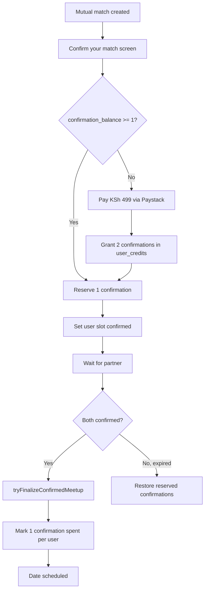

# Two-Confirmation Pack — Phased Implementation Plan

**Status:** Planning (docs only — no code changes yet)
**Depends on:** Phases 1–12 of the existing payment build (schema, Paystack, confirm gate, mobile UI)
**Supersedes:** Per-date "KSh 499 per person per date" model in [`../payment.md`](../payment.md) and locked decisions in [`README.md`](./README.md)

---

## Product rule (locked)

| Rule | Detail |
|---|---|
| **When payment appears** | Only after the user has a mutual match and reaches the **Confirm your match** screen |
| **What they pay** | KSh 499 once via Paystack |
| **What they get** | 2 date confirmations on their balance |
| **When a confirmation is spent** | Only when **both** users confirm **and** `tryFinalizeConfirmedMeetup` succeeds |
| **Second match** | If balance ≥ 1, user confirms without Paystack |
| **Partner ghosts** | Unused/reserved confirmations are restored; nothing spent |
| **Balance storage** | Reuse existing `user_credits` table (no new table) |
| **Rollout** | Behind `payments_enabled`, default OFF |

### User-facing copy (canonical)

```txt
Confirm your match

You both showed interest. To keep StrathSpace serious and reduce ghosting,
we ask you to confirm before we set up a date.

Pay KSh 499 once and get 2 date confirmations.

A confirmation is only used when you both confirm and we proceed with setting up the date.

If they don't confirm in time, your confirmation stays unused.
```

---

## Terminology

| Term | Meaning |
|---|---|
| **Confirmation pack** | KSh 499 Paystack purchase that grants 2 confirmations |
| **Confirmation** | One unit of balance that lets a user confirm one match |
| **Available confirmation** | Active credit in `user_credits` with status `active`, not tied to a pending match |
| **Reserved confirmation** | Credit temporarily held for a match where the user confirmed but partner has not yet |
| **Spent confirmation** | Credit marked `spent` after both users confirm and date setup proceeds |
| **Confirmation balance** | Count of available + reserved confirmations for a user |

---

## How this differs from today

| | Today (shipped) | After this plan |
|---|---|---|
| Paystack amount | KSh 499 per date match | KSh 499 per pack (2 confirmations) |
| Per-match charge | Every match triggers checkout | Only when balance = 0 |
| `user_credits` role | Refund/compensation ledger (KSh amounts) | **Also** confirmation balance ledger |
| Credit unit | Monetary (49900 cents = 1 date) | **Confirmation count** (tracked via `amount_cents` = unit value per confirmation) |
| Spend trigger | Paying = confirming | Confirm reserves; finalize spends |
| Expiry | Lone payer gets KSh 499 credit back | Restore reserved confirmation; pack credits stay |

---

## Architecture overview



### Balance math using `user_credits`

Reuse `user_credits` with confirmation-specific `reason` values. Each confirmation row uses:

```txt
amount_cents = DATE_CONFIRMATION_UNIT_CENTS  (24950 = 49900 / 2)
currency = KES
status = active | reserved | spent
```

**Balance query:** `sum(amount_cents) / DATE_CONFIRMATION_UNIT_CENTS` for rows with `status IN ('active', 'reserved')`.

Alternatively, store `amount_cents = 49900` per pack purchase row and track `confirmation_count` in metadata — see Phase 2 for the recommended approach.

**Recommended approach:** one `user_credits` row per confirmation unit (2 rows per pack purchase), each with `amount_cents = 24950`. This maps cleanly to "2 confirmations" without schema changes.

---

## Build phases

Build strictly in order. Each phase has its own acceptance criteria and test section.

| # | Phase | Ships value on its own? |
|---|---|---|
| 1 | Product rules & state language | Spec only |
| 2 | Backend credit model (`user_credits`) | Foundation |
| 3 | Paystack pack purchase flow | Buy pack end-to-end |
| 4 | Confirm match consumption flow | Core behavior change |
| 5 | Expiry, cancel, refund, restore | No stuck users |
| 6 | Mobile UI/UX flow | User-facing clarity |
| 7 | Admin, observability, support | Ops visibility |
| 8 | Testing & rollout | Safe launch |

---

## Phase 1 — Product Rules & State Language

**Goal:** Lock the state machine and user promises before touching code.

### Confirmation lifecycle

```txt
available → reserved → spent
available → reserved → available   (partner ghost / expiry / cancel)
```

### State transitions per match

| Event | User A balance | User B balance | Match payment_state |
|---|---|---|---|
| Match created | unchanged | unchanged | `awaiting_payment` |
| A confirms (has credit) | -1 available, +1 reserved | unchanged | `paid_waiting_for_other` |
| A pays pack (no credit) | +2 available, -1 reserved | unchanged | `paid_waiting_for_other` |
| B confirms | A: reserved→spent on finalize | -1 available, +1 reserved | `both_paid` (on finalize) |
| Finalize succeeds | A: 1 spent | B: 1 spent | `both_paid` |
| Window expires (A only confirmed) | A: reserved→available | unchanged | `expired` |

### Files to read (no changes yet)

- [`../payment.md`](../payment.md) — product spec
- [`phase-07-confirm-gate.md`](./phase-07-confirm-gate.md) — current confirm gate
- [`backend/strath-backend/src/lib/services/meetup-confirmation-service.ts`](../../backend/strath-backend/src/lib/services/meetup-confirmation-service.ts)

### Done when

- [ ] Team agrees: confirmation spent only on `tryFinalizeConfirmedMeetup` success
- [ ] Team agrees: payment UI only on mutual match confirm screen
- [ ] Terminology table above is the canonical reference for all later phases

---

## Phase 2 — Backend Credit Model Using `user_credits`

**Goal:** Define how confirmation balance is stored, queried, granted, reserved, spent, and restored — without a new table.

### Schema (reuse existing)

Table: `user_credits` in [`backend/strath-backend/src/db/schema.ts`](../../backend/strath-backend/src/db/schema.ts)

Add new `reason` values:

| Reason | When created | Initial status |
|---|---|---|
| `confirmation_pack_purchase` | Paystack pack verified | `active` |
| `confirmation_reserved` | User confirms a match (hold) | `reserved` |
| `confirmation_spent` | Both confirm + finalize | `spent` |
| `confirmation_restored` | Expiry/cancel before finalize | `active` |
| `partner_did_not_confirm` | Legacy; map to restore flow | `active` |
| `admin_restore` | Manual admin action | `active` |
| `admin_adjustment` | Manual admin grant/deduct | `active` or `spent` |

Add `date_match_id` on reserved/spent rows to link confirmation to match.

### New helper module

Create `src/lib/payments/confirmation-balance.ts`:

```ts
// Functions to implement:
getConfirmationBalance(userId)        // { available, reserved, total }
grantConfirmationPack(userId, paymentId, count = 2)
reserveConfirmationForMatch(userId, dateMatchId)
spendReservedConfirmation(userId, dateMatchId)
restoreReservedConfirmation(userId, dateMatchId)
canConfirmWithBalance(userId)       // available >= 1
```

### Config additions

In [`backend/strath-backend/src/lib/payments/config.ts`](../../backend/strath-backend/src/lib/payments/config.ts):

```env
DATE_CONFIRMATION_PACK_AMOUNT_CENTS=49900
DATE_CONFIRMATION_PACK_SIZE=2
DATE_CONFIRMATION_UNIT_CENTS=24950
```

### Migration

No new table. Optional: add `status = 'reserved'` to the `user_credits.status` enum if not present (check schema — today: `active | spent | expired`; add `reserved`).

```sql
-- Only if 'reserved' is not already a valid status value in application code
-- Application-level validation is sufficient if status is plain text
```

### Files to change

| File | Change |
|---|---|
| `src/db/schema.ts` | Document `reserved` status; optional type update |
| `src/lib/payments/config.ts` | Pack size + unit cents |
| `src/lib/payments/confirmation-balance.ts` | **New** — all balance operations |
| `src/lib/payments/payment-credit.ts` | Delegate to confirmation-balance helpers |
| `.env.example` | New env vars |

### How to test

1. Unit tests for `confirmation-balance.ts`:
   - Grant pack → balance = 2
   - Reserve → available = 1, reserved = 1
   - Spend → reserved = 0, spent row exists
   - Restore → available = 2 again
2. Idempotency: calling reserve twice for same match returns same result

### Done when

- [ ] `getConfirmationBalance` returns correct available/reserved/total
- [ ] Pack grant creates exactly 2 active credit rows
- [ ] Reserve/spend/restore are idempotent per `(userId, dateMatchId)`

---

## Phase 3 — Paystack Pack Purchase Flow

**Goal:** When a user with zero balance taps pay, KSh 499 checkout grants 2 confirmations (not just mark one date paid).

### Flow

```txt
User taps "Pay KSh 499" on confirm screen
        ↓
POST /api/payments/create-session (with dateMatchId for context)
        ↓
Paystack charges 49900 cents
        ↓
Webhook/verify → grantConfirmationPack(userId, paymentId, 2)
        ↓
Immediately reserve 1 for current dateMatchId
        ↓
Set user slot confirmed (same as today)
        ↓
Return success; user sees "1 confirmation left for your next match"
```

### Key behavioral change

Today [`payment-apply.ts`](../../backend/strath-backend/src/lib/payments/payment-apply.ts) `markPaymentPaid` marks the user paid for **this match only**.

After this phase:

1. `markPaymentPaid` calls `grantConfirmationPack(userId, paymentId, 2)`
2. Then calls `reserveConfirmationForMatch(userId, dateMatchId)`
3. Then sets slot confirmed (existing behavior)

### Paystack metadata

```json
{
  "purchase_type": "confirmation_pack",
  "pack_size": 2,
  "date_match_id": "<uuid>",
  "user_id": "<id>"
}
```

### Files to change

| File | Change |
|---|---|
| `src/lib/payments/payment-session-service.ts` | Pack purchase context |
| `src/lib/payments/payment-verification.ts` | Validate 49900 + pack metadata |
| `src/lib/payments/payment-apply.ts` | Grant pack + reserve on pay |
| `src/lib/payments/paystack-client.ts` | Metadata fields |
| `src/lib/payments/references.ts` | `strath_pack_*` reference prefix |
| `src/app/api/payments/create-session/route.ts` | Pack session |
| `src/app/payments/payment-checkout-client.tsx` | Pack copy on web checkout |

### Web checkout copy

```txt
Date Confirmation Pack — KSh 499

Includes:
• 2 date confirmations
• 1 used for this match when you both confirm
• 1 saved for your next match

A confirmation is only used when you both confirm and we set up the date.
```

### How to test

1. User with 0 balance, fresh mutual match → create-session → Paystack test pay
2. Assert `getConfirmationBalance` = `{ available: 1, reserved: 1, total: 2 }`
3. Assert `user_a_slot_confirmed_at` is set
4. Assert `date_payments` row exists with `status = paid`
5. Re-run verify/webhook → no duplicate credits (idempotent)

### Done when

- [ ] KSh 499 payment grants exactly 2 confirmations
- [ ] 1 confirmation auto-reserved for current match
- [ ] Slot confirmed on successful payment
- [ ] Idempotent verify/webhook

---

## Phase 4 — Confirm Match Consumption Flow

**Goal:** Users with balance confirm without Paystack. Spend confirmation only when both confirm and setup proceeds.

### `confirmMeetupSlot` changes

In [`meetup-confirmation-service.ts`](../../backend/strath-backend/src/lib/services/meetup-confirmation-service.ts):

```txt
if payments_enabled:
  if user has available confirmation >= 1:
    reserveConfirmationForMatch(userId, dateMatchId)
    set slot confirmed
    tryFinalizeConfirmedMeetup()
  else if user has paid payment row for this match:
  // already handled by payment flow
    proceed as today
  else:
    return { status: "payment_required", paymentToken, webPaymentUrl }
```

### `tryFinalizeConfirmedMeetup` changes

When both slots confirmed AND `payment_state` would be `both_paid`:

1. Call `spendReservedConfirmation(userAId, dateMatchId)`
2. Call `spendReservedConfirmation(userBId, dateMatchId)`
3. Proceed with venue scheduling (existing logic)

Guard in [`meetup-confirmation-payment.ts`](../../backend/strath-backend/src/lib/services/meetup-confirmation-payment.ts):

```ts
shouldBlockFinalizeForPayment:
  // both users must have reserved or paid for this match
  userAHasConfirmation && userBHasConfirmation
```

### Status API changes

[`payment-status-service.ts`](../../backend/strath-backend/src/lib/payments/payment-status-service.ts) should return:

```json
{
  "confirmationBalance": { "available": 1, "reserved": 0, "total": 1 },
  "canConfirmWithBalance": true,
  "paymentState": "awaiting_payment",
  ...
}
```

### Files to change

| File | Change |
|---|---|
| `src/lib/services/meetup-confirmation-service.ts` | Balance-first confirm path |
| `src/lib/services/meetup-confirmation-payment.ts` | Finalize guards |
| `src/lib/payments/payment-credit.ts` | `spendCreditOnDateMatch` uses balance |
| `src/lib/payments/payment-status-service.ts` | Expose balance |
| `src/lib/payments/payment-status-types.ts` | New fields |
| `src/app/api/me/match-hold/confirm-slot/route.ts` | New result: `confirm_with_balance` |
| `src/app/api/payments/status/route.ts` | Balance in response |
| `src/app/api/payments/use-credit/route.ts` | Auto-use balance (may merge into confirm) |

### How to test

**Scenario A — Second match, has 1 credit left**

1. User completed Phase 3 flow; has `available: 1`
2. New mutual match → tap Confirm (no Paystack)
3. Assert reserved: 1, available: 0
4. Partner confirms → finalize → spent: 1, available: 0

**Scenario B — No balance**

1. User with 0 balance → `payment_required` + token
2. Same as Phase 3

**Scenario C — Finalize guard**

1. Only A confirmed (reserved) → finalize blocked
2. B confirms → finalize succeeds → both spent

### Done when

- [ ] User with balance confirms without Paystack
- [ ] Confirmation spent only on successful finalize
- [ ] `payment_required` only when balance = 0
- [ ] Status API exposes `confirmationBalance`

---

## Phase 5 — Expiry, Cancel, Refund, and Restore Rules

**Goal:** Fair outcomes when matches fail; prefer restoring confirmations over refunds.

### Rules matrix

| Situation | User A | User B | Action |
|---|---|---|---|
| Neither confirms, window expires | unchanged | unchanged | Cancel match |
| A confirms, B does not | restore reserved | unchanged | Cancel; flag B |
| Both confirm, finalize fails (ops) | restore both | restore both | Admin investigates |
| User cancels hold before partner confirms | restore reserved | unchanged | Cancel match |
| Safety issue after finalize | admin decision | admin decision | Manual restore or refund |
| User wants refund of unused pack | — | — | Contact support; admin only |

### Expiry cron changes

[`payment-expiry.ts`](../../backend/strath-backend/src/lib/payments/payment-expiry.ts):

- Replace "grant KSh 499 credit to lone payer" with `restoreReservedConfirmation`
- Do **not** create new credit rows on expiry (confirmation was never spent)
- If user bought pack but match expired before partner confirmed: user keeps full balance

### Cancel changes

[`payment-cancel.ts`](../../backend/strath-backend/src/lib/payments/payment-cancel.ts):

- On cancel: `restoreReservedConfirmation` for any confirming user
- Remove auto-monetary credit grant for pack model (only for legacy per-date payments during migration)

### Refund policy

- **Unused confirmations:** no automatic refund; they stay on balance
- **Spent confirmations:** no refund (date setup proceeded)
- **Pack purchased but 0 confirmations used, user requests refund:** admin manual via Paystack refund + deduct credit rows

### Files to change

| File | Change |
|---|---|
| `src/lib/payments/payment-expiry.ts` | Restore instead of monetary credit |
| `src/lib/payments/payment-expiry-types.ts` | Updated result types |
| `src/lib/payments/payment-cancel.ts` | Restore on cancel |
| `src/lib/services/match-hold-service.ts` | Cancel integration |
| `src/app/api/cron/payment-expiry/route.ts` | Cron behavior |
| `src/app/api/payments/refund-choice/route.ts` | Deprecate or limit to legacy |

### How to test

1. A confirms (reserved), B never confirms, window expires → A has same total balance as before match
2. Neither confirms → both balances unchanged
3. Both confirm, finalize → 1 spent each
4. Cancel hold mid-flow → reserved restored

### Done when

- [ ] Expiry restores reserved confirmations (no monetary credit for pack)
- [ ] Cancel restores reserved confirmations
- [ ] Lone confirmer never loses a confirmation to ghosting
- [ ] Legacy per-date payments still handled during migration window

---

## Phase 6 — Mobile UI/UX Flow

**Goal:** Make the pack model obvious, friendly, and easy to use on the confirm screen.

### New UI phases

Extend `PaymentUiPhase` in [`lib/payment-ui.ts`](../../lib/payment-ui.ts):

| Phase | When | Copy |
|---|---|---|
| `has_balance_confirm` | Balance ≥ 1, not yet confirmed | "You have X date confirmations. Tap to confirm this match." |
| `awaiting_pack_payment` | Balance = 0 | "Pay KSh 499 once. Get 2 date confirmations." |
| `paid_waiting` | Confirmed, waiting for partner | "You confirmed. Waiting for [name] to confirm." |
| `both_confirmed` | Both confirmed | "You're both confirmed. We're arranging this one." |
| `expired_restored` | Expired, had reserved | "They didn't confirm in time. Your confirmation was not used. You have X left." |
| `low_balance_hint` | After first match, 1 left | "1 confirmation left for your next match." |

### Confirm screen layout

[`components/dates/meetup-slot-confirm.tsx`](../../components/dates/meetup-slot-confirm.tsx):

```txt
┌─────────────────────────────────────┐
│  Confirm your match                 │
│                                     │
│  You both showed interest. Confirm  │
│  before we set up your date.        │
│                                     │
│  ┌─ Balance pill ─────────────┐   │
│  │  🎟  2 date confirmations   │   │  ← show when balance > 0
│  └─────────────────────────────┘   │
│                                     │
│  [Wed 17:30 · Student Centre]       │
│                                     │
│  ┌─────────────────────────────┐   │
│  │  Confirm match              │   │  ← balance path
│  │  — or —                     │   │
│  │  Pay KSh 499 · get 2        │   │  ← no balance path
│  └─────────────────────────────┘   │
│                                     │
│  A confirmation is only used when │
│  you both confirm.                  │
└─────────────────────────────────────┘
```

### Balance visibility

- Show balance pill on: confirm modal, dates tab hold card, profile/settings (optional Phase 6b)
- Surface `confirmationBalance` from [`use-payment-status.ts`](../../hooks/use-payment-status.ts)

### Copy consolidation

Single source of truth: `lib/payment-ui.ts` + `lib/confirmation-copy.ts` (new).

All surfaces import from there:

| Surface | File |
|---|---|
| Confirm modal | `meetup-slot-confirm.tsx`, `meetup-slot-confirm-modal.tsx` |
| Status banner | `payment-status-banner.tsx` |
| Action banner | `action-required-banner.tsx` |
| Home hold card | `date-hold-card.tsx` |
| Hosted checkout | `payment-checkout-client.tsx` |
| Push notifications | `payment-push-notifications-service.ts` |

### Fixes bundled in this phase

- Pass `dateMatchId` in [`chat-access-gate.tsx`](../../components/chat/chat-access-gate.tsx) (today payment is broken in chat)
- Standardize currency label: `KSh 499` (not `KES 499`) in user-facing copy

### Toast messages

| Event | Toast |
|---|---|
| Confirmed with balance | "Match confirmed. 1 confirmation left for next time." |
| Pack purchased | "You have 2 date confirmations. 1 is reserved for this match." |
| Partner confirmed | "[Name] confirmed. We're arranging your date." |
| Expired, restored | "Match expired. Your confirmation was not used." |

### How to test

1. Manual walkthrough: 0 balance → pay → confirm → see balance pill
2. Second match: confirm without payment screen
3. Expiry: see restored copy
4. Chat gate: payment works with `dateMatchId`
5. All copy uses KSh not KES

### Done when

- [ ] Balance visible on confirm screen
- [ ] Clear distinction between "Confirm" and "Pay KSh 499"
- [ ] Post-payment shows remaining confirmations
- [ ] Expired state explains confirmation was not used
- [ ] Chat gate passes `dateMatchId`

---

## Phase 7 — Admin, Observability, and Support

**Goal:** Ops can see balances, trace confirmations, and handle edge cases.

### Admin dashboard additions

In [`admin-payments.ts`](../../backend/strath-backend/src/lib/actions/admin-payments.ts) and admin UI:

| View | Data |
|---|---|
| User profile panel | `confirmationBalance: { available, reserved, spent total }` |
| Per match | Each user's confirmation status: none / reserved / spent |
| Credit ledger | All `user_credits` rows with new reasons |
| Manual actions | Grant 1–2 confirmations, restore, revoke |

### Admin actions

```txt
Grant confirmations (promo / goodwill)
Restore reserved confirmation
Revoke unused confirmation (with reason)
Issue Paystack refund for pack (deducts credit rows)
```

### Analytics events

```txt
confirmation_pack_purchased
confirmation_reserved
confirmation_spent
confirmation_restored
confirmation_balance_zero
second_match_no_payment
```

### Logging

```txt
[confirmation-balance] grant pack userId=… count=2 paymentId=…
[confirmation-balance] reserve userId=… dateMatchId=…
[confirmation-balance] spend userId=… dateMatchId=…
[confirmation-balance] restore userId=… dateMatchId=… reason=expiry|cancel|admin
```

### Files to change

| File | Change |
|---|---|
| `src/lib/actions/admin-payments.ts` | Balance queries + manual actions |
| `src/app/admin/payments/[dateMatchId]/page.tsx` | Per-match confirmation status |
| `src/components/admin/payments/payment-ui.tsx` | Balance display |
| `src/lib/actions/admin.ts` | Flag description update |

### Done when

- [ ] Admin can see user confirmation balance
- [ ] Admin can see per-match reserved/spent status
- [ ] Admin can manually grant/restore/revoke
- [ ] Analytics events fire correctly

---

## Phase 8 — Testing & Rollout

**Goal:** Safe launch with full regression coverage.

### Test matrix

| # | Scenario | Flag | Expected |
|---|---|---|---|
| 1 | Free flow | OFF | Unchanged from today |
| 2 | First match, no balance | ON | Paystack → 2 credits, 1 reserved |
| 3 | Second match, 1 available | ON | Confirm without Paystack |
| 4 | Both confirm | ON | 1 spent each, date scheduled |
| 5 | A confirms, B ghosts | ON | A's confirmation restored |
| 6 | Neither confirms | ON | Balances unchanged |
| 7 | Cancel hold mid-flow | ON | Reserved restored |
| 8 | Paystack idempotency | ON | No duplicate credits |
| 9 | Admin grant | ON | Balance increases |
| 10 | Legacy per-date payment | ON | Migrated or refunded |

### Unit test files

| File | Coverage |
|---|---|
| `confirmation-balance.test.ts` | **New** — grant/reserve/spend/restore |
| `meetup-confirmation-payment.test.ts` | Finalize guards with balance |
| `payment-apply.test.ts` | Pack grant on pay |
| `payment-expiry.test.ts` | Restore on expiry |
| `payment-status.test.ts` | Balance in status response |

### Rollout plan

```txt
Phase A: Deploy code, payments_enabled = false
Phase B: Staff testing with flag ON (internal users)
Phase C: 10% rollout (if supported) or pilot cohort
Phase D: Full rollout
```

### Migration for existing users

Users who already paid per-date (legacy `date_payments`):

- Option A: Grant 1 confirmation per paid match (simple)
- Option B: Grant 2 confirmations if they paid 499 (generous)
- Document choice in admin runbook before flip

### Rollback

Set `payments_enabled = false` → free confirm flow resumes. Pack credit rows remain in DB but are ignored until re-enabled.

### Done when

- [ ] All 10 scenarios pass
- [ ] Staff pilot signed off
- [ ] Migration plan for legacy payers documented
- [ ] Rollback tested

---

## File index (all touched files)

### Backend

```
src/db/schema.ts
src/lib/payments/config.ts
src/lib/payments/confirmation-balance.ts          (new)
src/lib/payments/payment-credit.ts
src/lib/payments/payment-apply.ts
src/lib/payments/payment-session-service.ts
src/lib/payments/payment-verification.ts
src/lib/payments/payment-status-service.ts
src/lib/payments/payment-status-types.ts
src/lib/payments/payment-expiry.ts
src/lib/payments/payment-cancel.ts
src/lib/payments/paystack-client.ts
src/lib/payments/references.ts
src/lib/services/meetup-confirmation-service.ts
src/lib/services/meetup-confirmation-payment.ts
src/lib/services/match-hold-service.ts
src/lib/services/payment-push-notifications-service.ts
src/lib/actions/admin-payments.ts
src/app/api/payments/create-session/route.ts
src/app/api/payments/status/route.ts
src/app/api/payments/use-credit/route.ts
src/app/api/me/match-hold/confirm-slot/route.ts
src/app/api/cron/payment-expiry/route.ts
src/app/payments/payment-checkout-client.tsx
```

### Mobile

```
lib/payment-ui.ts
lib/confirmation-copy.ts                          (new)
lib/payment-api.ts
hooks/use-payment-status.ts
hooks/use-pay-to-confirm.ts
components/dates/meetup-slot-confirm.tsx
components/dates/meetup-slot-confirm-modal.tsx
components/dates/payment-status-banner.tsx
components/dates/payment-credit-actions.tsx
components/attention/action-required-banner.tsx
components/home/date-hold-card.tsx
components/chat/chat-access-gate.tsx
```

---

## Relationship to existing phases 1–12

The existing payment infrastructure (schema, Paystack, web checkout, confirm gate,
mobile UI, admin, notifications) remains the foundation. This plan **extends** it:

| Existing phase | Still needed? | Change |
|---|---|---|
| 1 — DB schema | Yes | Minor: `reserved` status |
| 2 — Paystack + token | Yes | Pack metadata |
| 3 — create-session | Yes | Pack context |
| 4 — web payment page | Yes | Pack copy |
| 5 — verify + webhook | Yes | Grant pack on verify |
| 6 — status API | Yes | Add balance fields |
| 7 — confirm gate | Yes | Balance-first path |
| 8 — expiry cron | Yes | Restore not monetary credit |
| 9 — refund/credit | Partial | Deprecate for pack; keep for legacy |
| 10 — mobile UI | Yes | New phases + balance pill |
| 11 — notifications | Yes | Updated copy |
| 12 — admin | Yes | Balance visibility |

**Minimum to ship pack model:** Phases 1–6 of this doc + existing phases 1–8, 10.
